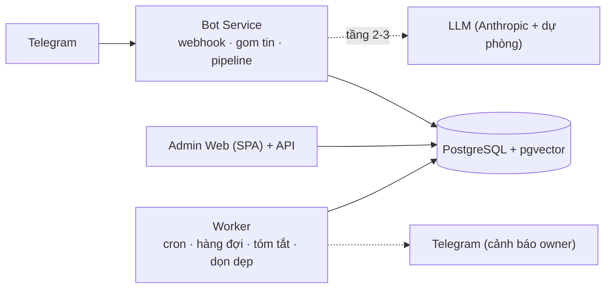

# InterLink Support Bot v2

Bot hỗ trợ khách hàng InterLink trên Telegram, xây lại từ hệ thống OpenClaw cũ theo [docs/de_xuat_kien_truc_moi.md](docs/de_xuat_kien_truc_moi.md).

- **Trả lời nguyên văn** từ kho template đã duyệt; LLM chỉ phân loại (tầng 2) hoặc sinh có trích dẫn cho câu hỏi tri thức (tầng 3). Đa số tin nhắn **không tốn token**.
- **Cổng quyết định** bằng code: bảo mật, `requires/excludes`, ngữ cảnh, `response_mode`, kiểm tra đầu ra. Luật không nằm trong prompt.
- **Admin Web**: xem lịch sử theo từng vấn đề, ticket, dashboard/usage; **Admin tự nạp file `.md`** (Draft → 6 bước kiểm tra → Publish, rollback), không cần lập trình viên.
- Toàn bộ dữ liệu ở **PostgreSQL + pgvector** thay cho ~20.000 file JSON.
- Ràng buộc của hệ thống cũ được truy vết đầy đủ ở [docs/RANG_BUOC.md](docs/RANG_BUOC.md).

## Kiến trúc



Ba khối chạy từ cùng một image (`dist/bot.js`, `dist/admin.js`, `dist/worker.js`). Hàng đợi việc nền nằm trong Postgres (`jobs`, `FOR UPDATE SKIP LOCKED`), không cần Redis.

```
src/
  core/     luật quyết định thuần (không I/O): sanitize (FP-0), antispam, language, router, gate, follow-up, templates
  bot/      pipeline xử lý tin, Telegram, gom tin, episode, resolver (dịch một lần)
  kb/       kho tri thức: parse, kiểm tra, publish, rollback, eval, seed
  llm/      Anthropic SDK + provider dự phòng OpenAI-compatible, circuit breaker, embedding
  db/       migration SQL, repository (pg và PGlite dùng chung một bộ SQL)
  admin/    Admin API (Fastify) + web tĩnh (src/admin/web)
  worker/   lịch, job, runner
content/    templates/*.md (nội dung được duyệt) · knowledge/*.md · config/predicates.yml · eval/
legacy/     luật cũ (AGENTS.md, skills) — nguồn đối chiếu cho `npm run parity`
docs/       mô tả hệ thống, kiến trúc, ma trận ràng buộc
tests/      143 test (Postgres thật bằng PGlite, gồm cả đường driver `pg`)
```

## Chạy thử nhanh (một tiến trình, không cần Docker)

```bash
npm install
cp .env.example .env        # điền TELEGRAM_BOT_TOKEN, ADMIN_TELEGRAM_IDS, OWNER_TELEGRAM_ID
                            # DATABASE_URL=pglite:./data/pgdata, TELEGRAM_MODE=polling
npm run seed                # nạp template, tri thức, predicate, admin, bộ câu hỏi mẫu (idempotent)
npm run dev:bot             # nhận tin Telegram (polling)
npm run dev:admin           # http://localhost:3001
npm run dev:worker
```

> PGlite là Postgres nhúng, **chỉ một tiến trình mở được một thư mục dữ liệu**. Muốn chạy cả ba khối cùng lúc hãy dùng Postgres thật (Docker Compose bên dưới hoặc `DATABASE_URL=postgres://...`).

## Triển khai (Docker Compose)

```bash
cp .env.example .env        # điền đủ; TELEGRAM_MODE=webhook, TELEGRAM_WEBHOOK_SECRET, PUBLIC_BOT_URL, COOKIE_SECURE=true, TRUST_PROXY=true
docker compose up -d --build
```

Đặt `bot` (cổng 3000) và `admin` (cổng 3001) sau reverse proxy HTTPS. Không publish cổng Postgres.

**Đăng nhập Admin Web:** mở trang quản trị → nhập Telegram ID → bot gửi mã 6 số vào chính chat Telegram của bạn (hết hạn 5 phút) → nhập mã. Không có mật khẩu để lộ. Vai trò: `owner` (Anh Phi) · `admin` · `viewer` (chỉ xem, ID khách bị che).

## Thêm / sửa nội dung không cần lập trình viên

Trong Admin Web → **Kho tri thức**: tải hoặc soạn file `.md` → **Kiểm tra** → **Publish**. Bot dùng ngay, không khởi động lại.

Định dạng template (một file có thể chứa nhiều template, ngăn cách bằng `<!-- next -->`):

```markdown
---
id: withdraw-question
group: Withdraw
response_mode: EXACT_TEMPLATE        # EXACT_TEMPLATE | GROUNDED_GENERATION | SECURITY_RULE
priority: 880                        # cao hơn = ưu tiên khi trùng
match:
  keywords: [withdraw, rút tiền]     # cụm từ (bỏ dấu, khớp theo ranh giới từ)
  examples: ["how do I take my tokens out"]
  excludes: [completed_level_1]      # predicate/điều kiện loại trừ (content/config/predicates.yml)
follow_up: { negative: ESCALATE, thanks: you-are-welcome }
sets_context: { issue: withdraw availability, status: pending }
---
<!-- answer:en -->
Câu trả lời nguyên văn gửi cho khách.
<!-- answer:vi -->
(tuỳ chọn) bản tiếng Việt đã duyệt
```

Sáu bước kiểm tra trước khi Publish: cấu trúc · quét an toàn (secret, script, URL lạ) · trùng/mâu thuẫn · bản dịch · **hồi quy** (so với bộ câu hỏi mẫu) · **replay** (14 ngày tin nhắn thật). Bản có `SECURITY_RULE` chỉ `owner` đề xuất và cần **người thứ hai duyệt**.

Tài liệu tri thức (whitepaper...) dùng `response_mode: GROUNDED_GENERATION`, xem `content/knowledge/`.

## Lệnh hữu ích

| Lệnh | Việc |
|---|---|
| `npm test` | Chạy toàn bộ test (Postgres thật bằng PGlite, kênh Telegram và LLM giả) |
| `npm run typecheck` | Kiểm tra kiểu |
| `npm run parity` | Đối chiếu nguyên văn mọi câu trả lời cố định với `legacy/` |
| `npm run eval` | Độ chính xác tầng 0–1 trên bộ câu hỏi mẫu (không tốn token) |
| `npm run build` | Đóng gói vào `dist/` |
| `npm run migrate` | Áp dụng migration SQL |

## Không có LLM thì sao?

Bot vẫn chạy: FP-0, chống spam, mọi template khớp từ khoá/rule/ảnh (cần vision để đọc ảnh), follow-up. Câu không khớp được chuyển người thật (FP-12 + ticket). Có `ANTHROPIC_API_KEY` (hoặc endpoint OpenAI-compatible) thì bật thêm phân loại câu diễn đạt tự nhiên, đọc ảnh, dịch template, tóm tắt cuộn.

## Cần biết trước khi chuyển kênh

Xem mục 6 của [docs/RANG_BUOC.md](docs/RANG_BUOC.md): những gì **chưa** được kiểm chứng (độ trễ/độ chính xác trên traffic thật, LLM/embedding/Telegram thật, Docker Compose). Bộ câu hỏi mẫu hiện có 215 câu là bộ khởi điểm; nên bổ sung ~300 câu thật từ transcript cũ rồi chạy giai đoạn shadow.
