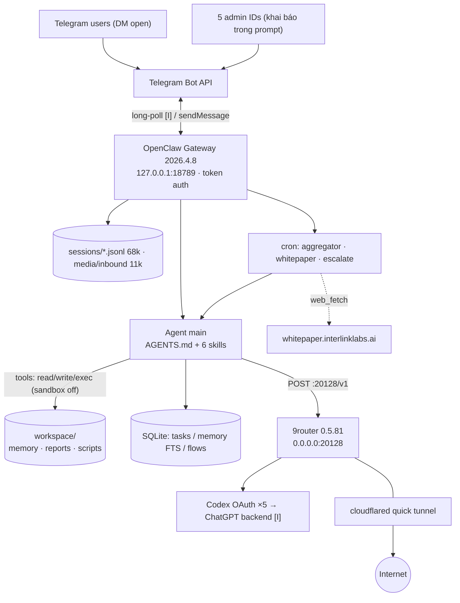
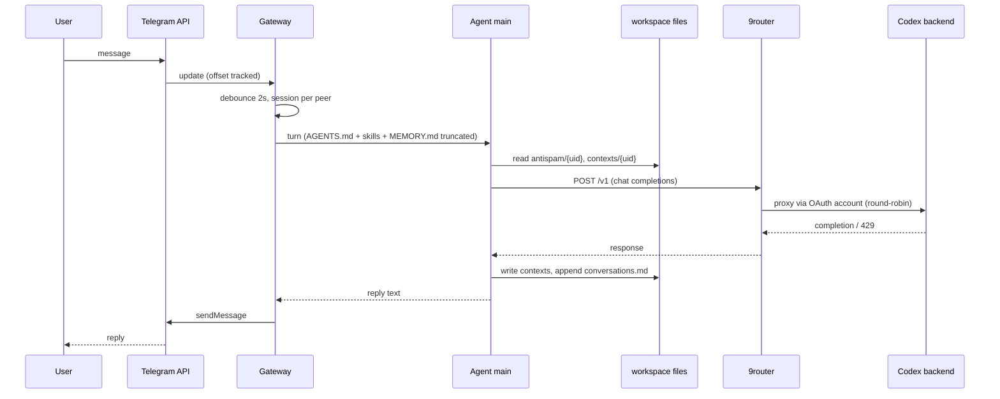
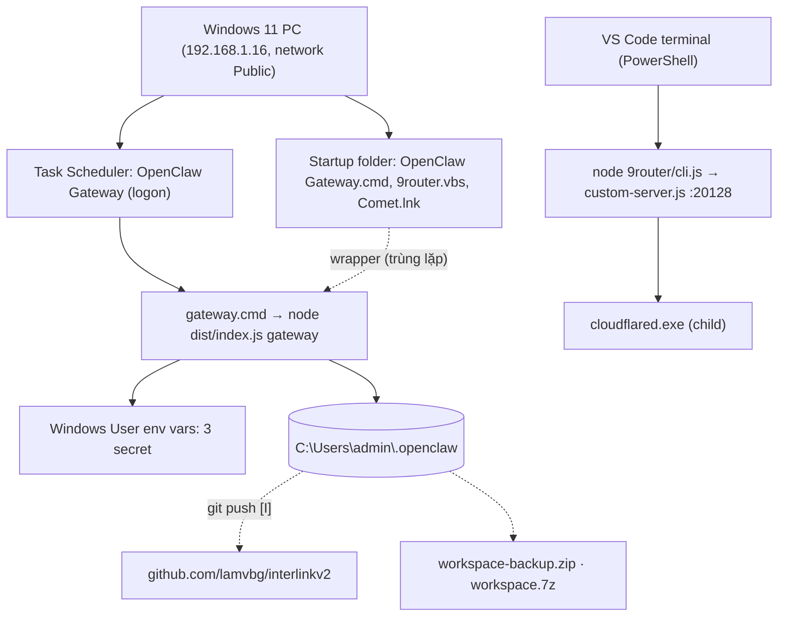
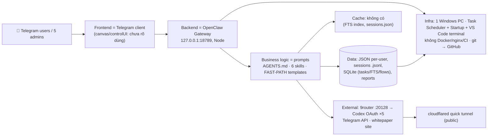

# SYSTEM ARCHITECTURE REPORT — OpenClaw / InterLink Support Bot

- Ngày audit: 2026-09-19
- Phạm vi: `C:\Users\admin\.openclaw` (chỉ đọc, không sửa source/config/database/infrastructure)
- Nhãn bằng chứng: **[C]** CONFIRMED (đã xác minh từ source/runtime) · **[I]** INFERRED (suy luận từ source) · **[U]** UNKNOWN (chưa đủ dữ liệu)
- Secret đã được redact; ID Telegram cá nhân được che.

Ghi chú phương pháp: khi audit, các file sqlite được copy sang thư mục scratchpad của session (ngoài project) để mở; có gọi `GET /v1/models` vào 9router qua loopback và IP LAN. Không có thay đổi nào trong project.

---

## 1. Executive Summary

- Đây **không phải** hệ thống web frontend/backend/DB truyền thống. Đây là một **AI-agent gateway (OpenClaw 2026.4.8)** chạy trên một máy Windows 11 cá nhân, làm **bot hỗ trợ khách hàng InterLink qua Telegram**. [C]
- Luồng chính: Telegram → OpenClaw Gateway (Node, `127.0.0.1:18789`) → agent `main` → LLM qua proxy cục bộ **9router** (`:20128`) → Codex/ChatGPT OAuth. [C]
- "Business logic" nằm trong **prompt và file markdown**: `AGENTS.md`, 6 skill `.md` và các FAST-PATH template. Không có code ứng dụng nào ngoài các script vận hành. [C]
- "Database" là **file JSON theo từng user** (`memory/antispam`, `memory/contexts`), transcript `.jsonl` và 3 file SQLite nhỏ của OpenClaw. Không có Postgres, Redis, Qdrant hay queue ngoài. [C]
- Tiến trình do Windows Task Scheduler và Startup folder khởi chạy. 9router thì đang chạy từ một terminal VS Code, và có thêm một `cloudflared` tunnel công khai. Không có Docker, nginx hay CI/CD. [C]
- Có 3 cron job trong gateway, trong đó 2 job lỗi kéo dài. Delivery queue có 1.083 tin thất bại. [C]
- Rủi ro lớn nhất: bot mở DM cho mọi người, có tool `exec`/`write`, sandbox tắt, phân quyền chỉ bằng prompt. 9router bind `0.0.0.0` kèm tunnel công khai. Dữ liệu cá nhân tích tụ lớn (~4 GB) và một phần đang nằm trong git.

---

## 2. Technology Stack

| Layer | Technology | Purpose | Evidence |
|---|---|---|---|
| Runtime | Node v24.14.0 (yêu cầu ≥22.14) | Chạy gateway và 9router | `node --version`, `openclaw/package.json` [C] |
| Agent gateway | OpenClaw 2026.4.8 (có bản 2026.9.4) | Channel, session, tool, cron, agent loop | `update-check.json` [C] |
| Channel | Telegram Bot API | Kênh duy nhất đang bật | `openclaw.json → channels.telegram` [C] |
| LLM proxy | 9router 0.5.81 | OpenAI-compatible proxy sang Codex OAuth | `9router/package.json` [C] |
| LLM | `9router/cx/gpt-5.5` | Model mặc định | `agents.defaults.model` [C] |
| Storage | SQLite (WAL), JSON, JSONL, Markdown | Task ledger, FTS memory, state, transcript | file listing [C] |
| Tunnel | cloudflared quick tunnel | Public URL cho 9router | process 18220 [C] |
| Scheduler | OpenClaw cron + Windows Task Scheduler | Job định kỳ / autostart | `cron/jobs.json`, task "OpenClaw Gateway" [C] |
| Scripts | Node ESM/CJS, Python 3.11 | Aggregator, broadcast, heartbeat, đếm escalation | `workspace/scripts`, workspace root [C] |
| VCS | git → `github.com/lamvbg/interlinkv2` | Versioning workspace | `git remote -v` [C] |
| Frontend | Không có UI riêng. Có `canvas/index.html` và `gateway.controlUi` | Control UI của OpenClaw | [C] có file, [U] cách dùng |
| Cache / Queue / Vector DB / Docker / nginx / CI | Không tìm thấy | — | Đã search Dockerfile, compose, nginx, `.github`, pm2 [C] |

---

## 3. Project Structure

Root: `C:\Users\admin\.openclaw` (không phải git repo). Chỉ `workspace/` là git repo, branch `main`.

```
.openclaw/
├─ openclaw.json (+ 5 file .bak)   config chính, secret dùng env-ref
├─ gateway.cmd                     entry autostart của gateway
├─ start-9router.cmd               launcher 9router (chỉ là file, chưa chắc là thứ đang chạy)
├─ exec-approvals.json             allowlist exec (1 pattern)
├─ agents/main/{agent,sessions}    models.json; 68.221 file transcript (1,67 GB) + sessions.json (3,8 MB, 167 entry)
├─ cron/{jobs.json,runs/}          3 job + lịch sử run (a24e…jsonl 1,9 MB)
├─ tasks/runs.sqlite               task ledger (172 dòng, toàn cron)
├─ memory/main.sqlite              chỉ mục FTS (141 chunk, 11 file, model "fts-only")
├─ flows/registry.sqlite           rỗng (0 dòng)
├─ telegram/                       update-offset, command-hash
├─ delivery-queue/failed/          1.083 tin gửi thất bại
├─ devices, identity, credentials  pairing, key thiết bị, allowFrom/pairing Telegram
├─ media/inbound/                  11.004 file (2,15 GB) ảnh user gửi
├─ logs/                           commands.log, config-audit.jsonl, config-health.json
├─ canvas/, completions/, docs/    UI tĩnh, shell completion, tài liệu InterLink
├─ qqbot/data/                     rỗng (channel không dùng)
├─ workspace-backup.zip, workspace.7z, *.xlsx, *.jpg   file rời ở root
└─ workspace/                      ← workspace của agent (git)
   ├─ AGENTS.md, SOUL/TOOLS/USER/IDENTITY/HEARTBEAT/BOOTSTRAP.md, MEMORY.md (97 K ký tự)
   ├─ skills/  6 skill (chỉ .md, không có code)
   ├─ scripts/ 10 file (usage-aggregator, broadcast-telegram, …)
   ├─ memory/  antispam/ (12.105 file), contexts/ (7.613 file), conversations/ (7 file md), *.md tri thức
   ├─ reports/ usage-daily.jsonl (167 MB), user-index.json (22 MB), report md
   └─ ~37 script dùng một lần ở root (count_escalation*, heartbeat*, tmp*), 48 file HTML export
```

**Entry point**
- Gateway: `node …\openclaw\dist\index.js gateway --port 18789`. [C]
- 9router: `node …\9router\cli.js`. [C]
- Cron script duy nhất còn hoạt động: `workspace/scripts/usage-aggregator.mjs`. [C]

**Pattern:** agent-driven, không có controller/service/repository. Hai flow thực tế:
- `message → prompt rules → LLM → tool read/write file → reply`
- `cron → agent turn (LLM) → exec script`

---

## 4. System Components

| Component | Công nghệ | Port | Entry | Chức năng | Phụ thuộc |
|---|---|---|---|---|---|
| OpenClaw Gateway | Node | 18789 (loopback v4+v6); 18791 (loopback); 59851 (loopback) | `dist/index.js gateway` | Nhận Telegram, quản lý session, chạy agent, tool, cron | Telegram API, 9router, filesystem |
| Agent `main` | Trong gateway | — | `agents.defaults` | Chạy prompt `AGENTS.md` + skill | LLM, workspace |
| 9router | Node (Next custom-server) | **0.0.0.0:20128** | `cli.js` → `app/custom-server.js` | Proxy LLM, pool 5 connection Codex OAuth, round-robin | ChatGPT backend [I], cloudflared |
| cloudflared | Go binary (con của 9router) | 127.0.0.1:20241 (metrics) | `--url http://127.0.0.1:20128` | Quick tunnel public | Cloudflare edge (`:7844`) |
| Cron scheduler | Trong gateway | — | `cron/jobs.json` | 3 job | agent, 9router |
| SQLite stores | sqlite WAL | — | — | Task ledger, FTS memory, flows | gateway |
| Skills | Markdown | — | `workspace/skills/*` | Kiến thức và luật trả lời | agent |
| Ops scripts | Node/Python | — | `workspace/scripts` | Aggregator, broadcast | filesystem, Telegram API |

Ghi chú listener:
- 18791 [I] có thể là browser/canvas control.
- 59851 [U].
- Hai process `python` (`0.0.0.0:8000`, `127.0.0.1:8781`) không có tham chiếu nào từ workspace. [U]

### Cron jobs (từ `cron/jobs.json`)

| Job | Lịch | Việc | Trạng thái |
|---|---|---|---|
| `usage-aggregator-daily` | `5 * * * *` UTC (hàng giờ, dù tên là "daily") | Agent `exec node scripts/usage-aggregator.mjs`, reply `NO_REPLY` | ok, ~30 s/lần |
| `whitepaper-weekly-sync` | `0 20 * * 0` UTC | Đọc `SKILL.md`, `web_fetch` whitepaper, append vào `memory/whitepaper-data.md` | **error, 7 lỗi liên tiếp** ("Delivering to Telegram requires target <chatId>") |
| `daily-escalate-threshold-alert` | `59 23 * * *` Asia/Bangkok | Đếm template escalation trong transcript; > 100 thì nhắn admin | lần gần nhất lỗi 429 (usage limit), chạy 47 phút |

---

## 5. Runtime Architecture

| Câu hỏi | Kết quả |
|---|---|
| Developer chạy bằng gì | CLI `openclaw …` (vd. `openclaw hooks disable session-memory` trong `config-audit.jsonl`) [C]. Không thấy script dev riêng. |
| Production chạy bằng gì | Cùng một cấu hình: `gateway.cmd` → `node dist/index.js gateway --port 18789`. Không có tách dev/prod. [C] |
| Process manager (gateway) | Task Scheduler `OpenClaw Gateway`: trigger logon, user `admin`, RunLevel Limited, LastResult 267009 (đang chạy). [C] Startup folder còn `OpenClaw Gateway.cmd` (wrapper `start /min gateway.cmd`). [C] |
| Restart | Task có `RestartCount=0`, `MultipleInstances=IgnoreNew`. Không có supervisor tự khởi động lại khi crash. [C] Gateway hiện tại start 19:40:50, cha là `cmd /c gateway.cmd`. Lock ở `%TEMP%\openclaw\gateway.*.lock`. |
| Process manager (9router) | Instance đang chạy (PID 38808) có cha là **PowerShell của VS Code terminal**, không phải Startup và không có cờ `--skip-update`. [C] Startup folder có `9router.vbs` (`--tray --skip-update`). Hai thứ này không khớp nhau. [C] |
| Thứ tự start | Không có cơ chế ép thứ tự. Gateway trỏ cứng `localhost:20128`, không thấy logic chờ 9router. [I] |
| Env | Secret lấy từ **Windows User environment variables**: `TELEGRAM_BOT_TOKEN`, `NINE_ROUTER_API_KEY`, `OPENCLAW_GATEWAY_TOKEN`, cấu hình qua `{source:"env"}` trong `openclaw.json`. `gateway.cmd` set thêm `HOME`, `TMPDIR`, `OPENCLAW_*`. [C] |
| Tài nguyên | Gateway ~608 MB RSS; 9router ~231 MB; cloudflared 36 MB. [C] |
| Health check | Không thấy health-check riêng. Có `logs/config-health.json` (hash cấu hình last-known-good). [C] |
| Log | `logs/commands.log` (194 KB), `config-audit.jsonl`, transcript `.jsonl`, `%APPDATA%\9router\logs`. Log chuẩn của gateway ra file: [U]. |

---

## 6. Network Architecture

```
Internet ──(HTTPS)── Telegram Bot API (149.154.166.x:443)  ◄── gateway (outbound)
Internet ──(HTTPS)── *.trycloudflare.com ── cloudflared ──► 127.0.0.1:20128 (9router)
LAN/VPN (192.168.1.16, Radmin 26.x) ───────────────────────► 0.0.0.0:20128 (9router)
Gateway 127.0.0.1:18789 (token auth) ──► 9router 127.0.0.1:20128/v1 ──► ChatGPT/Codex backend [I]
```

- Gateway: `bind: loopback`, `auth.mode: token` (token qua env), `tailscale: off`, `allowInsecureAuth: false`. Không có reverse proxy hay domain riêng. [C]
- CORS: [U], không thấy cấu hình.
- Telegram dùng cơ chế `update-offset` (`telegram/update-offset-default.json`) nên nhiều khả năng là **long-polling**, không cần webhook/domain. [I]
- 9router:
  - Bind `0.0.0.0:20128`. [C]
  - Firewall có rule inbound allow cho `node.exe` trên profile Public, mọi port. Cả hai mạng máy này đều là "Public". [C]
  - `GET /v1/models` không kèm key: loopback trả **200**, IP LAN `192.168.1.16` trả **401**. [C]
  - Request đi qua cloudflared đến 9router từ `127.0.0.1`; 9router có coi đó là loopback tin cậy hay không thì [U]. Không gọi thử URL public.
- Node `--dns-result-order=ipv4first` cho 9router. Kết nối outbound của gateway sang `104.18.2.115:443` (Cloudflare range): đích cụ thể [U].

---

## 7. Database Architecture

| Store | Nội dung | Ghi chú |
|---|---|---|
| `tasks/runs.sqlite` | `task_runs` 172 dòng: 155 succeeded, 13 failed, 2 lost, 2 timed_out; toàn bộ runtime `cron` | 164 dòng là `usage-aggregator-daily` [C] |
| `memory/main.sqlite` | `chunks`/`chunks_fts`, 141 chunk từ 11 file (MEMORY.md 81 chunk…) | Model `fts-only`: chỉ full-text, **không có embedding/vector** [C] |
| `flows/registry.sqlite` | `flow_runs` | 0 dòng [C] |
| `sessions.json` + `*.jsonl` | Index session (167 entry: 142 telegram direct, 19 slash, 5 cron, 1 main) + transcript | Record type: `session`, `model_change`, `message`, `custom` [C] |
| `memory/antispam/{uid}.json` | `offtopic_count`, `blocked_until`, `last_seen` | 12.105 file [C] |
| `memory/contexts/{uid}.json` | `language`, `issue`, `status`, `last_bot_action`, … | 7.613 file [C] |
| `memory/conversations/YYYY-MM.md` | Log hội thoại append-only | Chỉ 7 file; 2026-08 là 641 B, 2026-09 là 128 B [C] |
| `reports/*` | `usage-daily.jsonl`, `user-index.json`, `usage-summary.json` | Do aggregator sinh ra |
| `%APPDATA%\9router\db\data.sqlite` | DB của 9router (516 MB), `db.json` cũ đã migrate từ 06/2026 | Không mở nội dung [C] |

- Không có ORM, migration hay Redis. Truy cập dữ liệu do agent đọc/ghi file trực tiếp, hoặc do OpenClaw nội bộ với SQLite. [C]
- Concurrency:
  - Session dùng file `.lock`, gateway dùng lock file, SQLite dùng WAL. [C]
  - File JSON theo user là read-modify-write, không thấy cơ chế khóa. [I]
  - `AGENTS.md` yêu cầu "APPEND ONLY" cho conversation log để tránh race. [C]
  - `maxConcurrent: 50`.

---

## 8. Authentication Architecture

| Lớp | Cơ chế | Evidence |
|---|---|---|
| Gateway API/UI | Token, lấy từ env `OPENCLAW_GATEWAY_TOKEN` | `gateway.auth` [C] |
| Thiết bị/CLI | Device pairing bằng public key. 1 thiết bị `cli`, role `operator`, scope gồm `operator.admin`, `operator.approvals`, `operator.talk.secrets` | `devices/paired.json` [C] |
| Telegram user | `dmPolicy: "open"`, `allowFrom: ["*"]`, tức **ai cũng nhắn được**. Nhóm: `requireMention: true` | `openclaw.json` [C] |
| Admin | 5 Telegram ID **hard-code trong `AGENTS.md` và `admin-console/SKILL.md`**. Phân quyền do LLM thực thi theo prompt. | [C] |
| Role user thường | "Không exec/process/web_search/cron, chỉ đọc `skills/`, `memory/…`". **Chỉ là văn bản prompt.** Không thấy chính sách tool theo người gửi trong `openclaw.json`. | [I] |
| Exec | `exec-approvals.json`: 1 allowlist cho agent `main` (`node scripts/usage-aggregator.mjs`); `defaults: {}` | [C] |
| Sandbox | `mode: off`, `sandboxed: false` | `systemPromptReport` của session mới nhất [C] |
| Tool profile | `tools.profile: "coding"` | [C] |
| LLM proxy | Gateway gửi `NINE_ROUTER_API_KEY`. 9router yêu cầu key với request không phải loopback. | [C] |

Flow: `User → Telegram → gateway (sender ID từ Telegram) → agent đọc AGENTS.md → so ID với danh sách admin → admin-console hoặc luồng user`. Không có JWT hay refresh token cho người dùng cuối.

---

## 9. Request Flow

**A. Tin nhắn hỗ trợ (flow chính)** [C, trừ chỗ ghi khác]
1. User gửi tin. Gateway nhận qua Bot API, debounce 2000 ms (`messages.inbound`).
2. Session key `agent:main:telegram:direct:<id>` (`dmScope: per-channel-peer`), reset khi idle 180 phút.
3. Agent nạp system prompt từ `AGENTS.md`, `SOUL.md`, …, `MEMORY.md` và snapshot skills.
4. Agent gọi LLM: `POST localhost:20128/v1` (openai-completions) → 9router → Codex OAuth.
5. Agent đọc song song `memory/antispam/{uid}.json` và `memory/contexts/{uid}.json`.
6. Nếu khớp FAST-PATH thì gửi nguyên văn template, không đọc SKILL.md. Không khớp thì đọc `interlink-support/SKILL.md`. Có ảnh thì dùng `image-reader`.
7. Ghi `contexts/{uid}.json`, append `conversations/YYYY-MM.md` (theo luật; thực tế log gần như ngừng [C], vì file 2026-09 chỉ 128 B), rồi gửi reply qua Bot API.

**B. Admin `/usage`, `/contexts`:** ID ∈ danh sách admin → đọc `reports/usage-summary.json` hoặc `contexts/*.json` → trả markdown. `/usage refresh` mới `exec` aggregator. [C]

**C. Cron `usage-aggregator-daily`:** tên là "daily" nhưng lịch `5 * * * *` UTC, tức **hàng giờ**. Mỗi lần gateway mở một agent turn (LLM ~30 s) chỉ để `exec node scripts/usage-aggregator.mjs`, rồi reply `NO_REPLY`. Script đọc toàn bộ 68K file transcript và ghi `reports/*`. [C]

**D. Cron `daily-escalate-threshold-alert`:** 23:59 Asia/Bangkok. LLM tự viết một script đếm rồi chạy. Nếu > 100 thì nhắn admin. Lần chạy gần nhất lỗi 429 sau 47 phút. [C]

---

## 10. Data Flow

```
Telegram text/ảnh → Gateway (debounce) → media/inbound (ảnh)
  → transcript .jsonl → prompt (rules + skills + MEMORY.md cắt bớt)
  → 9router → LLM → reply → Telegram
  ⤷ side effects: antispam/contexts JSON, conversations.md
transcript .jsonl ─(hourly, aggregator)→ usage-daily.jsonl / user-index.json / usage-summary.json ─→ admin /usage
memory/*.md ─→ memory/main.sqlite (FTS) → memory search [I]
whitepaper.interlinklabs.ai ─(weekly cron, web_fetch)→ memory/whitepaper-data.md
antispam/*.json (danh sách ID) ─(manual)→ broadcast-telegram.mjs → api.telegram.org
```

Không có Redis, queue, WebSocket của ứng dụng, RAG hay vector DB. `delivery-queue` là hàng đợi nội bộ của OpenClaw; hiện có 1.083 mục `failed`. [C]

---

## 11. Deployment Architecture

- Không có CI/CD (`.github` không tồn tại), không Docker, không nginx. [C]
- Cài đặt: `npm i -g openclaw` và `9router` (global, `%APPDATA%\npm`). Cập nhật thủ công. `start-9router.cmd` ghi rằng đã cố ý dùng `--skip-update` sau khi bản 0.5.50 lỗi 401. [C]
- Cấu hình: sửa tay `openclaw.json`. Sao lưu bằng file `.bak*` và `workspace-backup.zip` (29 MB, 17/09), `workspace.7z` (05/2026). [C]
- Workspace: commit lên GitHub (`lamvbg/interlinkv2`). Commit gần nhất 14/09 ("Record heartbeat maintenance"), 107 thay đổi chưa commit. [C]
- Deploy = máy này. Không có staging và không có môi trường thứ hai. [C]

---

## 12. Dependency Graph

```
Telegram user
└── Telegram Bot API
    └── OpenClaw Gateway (Task Scheduler)
        ├── TELEGRAM_BOT_TOKEN / OPENCLAW_GATEWAY_TOKEN / NINE_ROUTER_API_KEY (env)
        ├── 9router :20128 (khởi chạy thủ công/terminal)
        │   ├── 5× Codex OAuth connection (round-robin)
        │   │   └── ChatGPT/Codex backend [I]
        │   ├── data.sqlite (516 MB)
        │   └── cloudflared → *.trycloudflare.com
        ├── workspace/ (AGENTS.md, skills, memory, reports)
        ├── SQLite: tasks, memory(FTS), flows
        ├── cron: usage-aggregator (giờ), whitepaper-sync (tuần), escalate-alert (ngày)
        │   └── whitepaper.interlinklabs.ai
        └── scripts (broadcast → api.telegram.org)
```

---

## 13. Architecture Diagrams

### A. System Architecture



### B. Request Flow



### C. Deployment Architecture



---

## 14. Current Problems / Risks

| # | Vấn đề | Evidence | Mức | Vì sao có thể gây vấn đề |
|---|---|---|---|---|
| 1 | Bot mở DM cho tất cả, agent có `exec`/`write`, sandbox tắt, phân quyền chỉ bằng prompt | `channels.telegram.dmPolicy=open`, `allowFrom=["*"]`; `tools.profile=coding`; `sandbox.mode=off`; `AGENTS.md` Role-Based Access. Không thấy tool policy theo người gửi. | **Cao** | Prompt injection từ user bất kỳ có thể chạm tool trên host. Ranh giới admin/user chỉ tồn tại trong văn bản mà LLM tự tuân thủ. |
| 2 | 9router bind `0.0.0.0`, có firewall allow, và cloudflared tunnel công khai. Nó giữ 5 OAuth token | Listener `0.0.0.0:20128`; rule "Node.js JavaScript Runtime" Public/Any; `tunnel/state.json` có URL; PID 18220 | **Cao** | Bề mặt public cho proxy chứa credential LLM. Loopback không cần key (200 không auth). Nếu request từ tunnel bị coi là loopback thì có thể lọt key check: [U]. |
| 3 | Dữ liệu cá nhân số lượng lớn và nằm trong git | `reports/user-index.json` (10,8 MB) và `usage-daily.jsonl` (80,5 MB) ở HEAD; `broadcast-log.csv` (~12K ID) không bị `.gitignore`; 12K antispam + 7,6K contexts | **Cao** (nếu repo public) | Repo `lamvbg/interlinkv2` không rõ visibility [U]. `.gitignore` chỉ loại `memory/*` con và `.openclaw/`, không loại `reports/`, `scripts/*.csv`. |
| 4 | Retention không khớp cấu hình | `session.maintenance.pruneAfter=3d` nhưng chỉ 1.589/68.221 transcript ≤3 ngày; 8.884/11.004 ảnh >30 ngày; sessions 1,67 GB, media 2,15 GB | Trung bình | Dữ liệu người dùng (kể cả ảnh) lưu vô hạn. Aggregator đọc toàn bộ 68K file mỗi giờ. |
| 5 | Single point of failure và không có supervisor | 1 PC; `RestartCount=0`; 9router chạy từ VS Code terminal (cha PID 35288); `DisallowStartIfOnBatteries=True` | Trung bình | Đóng terminal, crash hoặc reboot chưa login làm bot ngừng, không tự hồi phục. |
| 6 | Phụ thuộc một đường LLM và giới hạn usage | Chỉ provider 9router; 429 `usage limit reached` ở job escalate (47 phút); connection Codex có `modelLock_*` | Trung bình | Hết quota/OAuth hỏng thì cả bot và cron cùng ngừng. `maxConcurrent=50` không giải quyết được nghẽn này. |
| 7 | Cron lỗi kéo dài, delivery queue đầy | `whitepaper-weekly-sync`: 7 lỗi liên tiếp ("requires target <chatId>", `channel:"last"`); `delivery-queue/failed`=1.083 (mẫu: "@heartbeat could not be resolved"); tasks: 13 failed, 2 lost, 2 timed_out | Trung bình | Đồng bộ whitepaper có thể không chạy. `HEARTBEAT.md` mong đợi sync hàng ngày nhưng cron thực tế là hàng tuần và skill mô tả 03:00 UTC+7. [C] Nội dung `whitepaper-data.md` còn được cập nhật hay không: [U]. |
| 8 | Bootstrap bị cắt | `MEMORY.md` 97.172 ký tự → 54.111 được inject, `truncated: true` (`bootstrapMaxChars=60000`) | Trung bình | Phần cuối `MEMORY.md` không tới được model. |
| 9 | Drift phiên bản/cấu hình | 9router cài 0.5.81 trong khi `start-9router.cmd` ghi ghim 0.5.45 vì lỗi 401; instance chạy không có `--skip-update`. OpenClaw 2026.4.8 vs 2026.9.4. Model mặc định `cx/gpt-5.5` không có trong `models[]` (chỉ 5.3-codex). Gateway có hai đường autostart (Task và Startup). | Trung bình–Thấp | Hành vi 9router có thể đổi khi tự cập nhật. Khai báo model không phản ánh thực tế. Trùng autostart phụ thuộc lock file để tránh chạy đôi [I]. |
| 10 | Script dùng một lần chồng chất, có thao tác xóa | 11 `count_escalation*`, ~16 `heartbeat*`, ~10 `tmp*` ở root; ngày và `now` hard-code; heartbeat gọi `unlink` lên antispam/contexts; job escalate để LLM sinh script mỗi ngày | Trung bình–Thấp | Logic trùng lặp. Chạy lại script cũ tính sai mốc xóa [I]. Định dạng log hội thoại đã đổi qua thời gian nên regex mỗi bản khác nhau. |
| 11 | Công cụ broadcast | `scripts/broadcast-telegram.mjs`: gửi tới mọi ID trong `memory/antispam/`, `parse_mode HTML`; log 12.056 dòng (11.375 ok, 681 fail); có `--yes` | Thấp–Trung bình | Danh sách người nhận là thư mục mà heartbeat cũng xóa dần. Đã chạy trong ngày hôm nay (mtime log 19:29). |
| 12 | Secret/credential dạng file thường | `exec-approvals.json` (socket token); `identity/device.json` (private key PEM); 9router `jwt-secret`, `cli-secret`, OAuth token trong DB; 3 secret ở User env | Thấp–Trung bình | Người dùng cùng máy hoặc backup zip/7z sẽ lộ. Không mở các file này để xác nhận nội dung. |
| 13 | Log hội thoại gần như ngừng | `conversations/2026-08.md` 641 B, `2026-09.md` 128 B so với 33 KB của 2026-04 | Thấp | `HEARTBEAT.md` và `conversation-logger` phụ thuộc file này để thống kê. |
| 14 | Danh sách admin trùng ở hai nơi | 5 ID trong `AGENTS.md` và `admin-console/SKILL.md` | Thấp | Sửa một nơi bỏ sót nơi kia. |

---

## 15. Unknowns

- **[U]** Visibility của repo GitHub `lamvbg/interlinkv2`, và có ai push tự động hay không.
- **[U]** URL tunnel có nhận request công khai vào 9router không, và 9router xử lý request tunnel (nguồn 127.0.0.1) như thế nào.
- **[U]** Chức năng của listener `18791` và `59851` trên gateway, và của 2 process `python` (`:8000`, `:8781`).
- **[U]** Telegram nhận tin bằng polling hay webhook (suy luận polling từ offset file).
- **[U]** Bot đang chạy là `@AIsupportinterlinkbot` hay `@AIsupportinterlink_bot`. `broadcast-message.txt` nói bot cũ bị ngừng ngày 2026-09-19 nhưng gateway không nêu handle.
- **[U]** Vị trí log runtime của gateway; hành vi exec-approval thực tế với các lệnh ngoài allowlist.
- **[U]** Việc `whitepaper-data.md` còn được cập nhật (7 lỗi cron liên tiếp).
- **[U]** Nội dung DB 9router (516 MB) và credential trong đó, do không mở để tránh lộ secret.

---

## 16. Final System Map



### Phân biệt 3 kiến trúc

- **Code architecture:** agent-driven, luật bằng markdown, script vận hành nhỏ.
- **Runtime architecture:** gateway (Task Scheduler) + 9router (terminal) + cloudflared, cron gọi LLM để exec script.
- **Deployment architecture:** một PC Windows, cài npm global, cấu hình sửa tay, không staging, không CI/CD.
