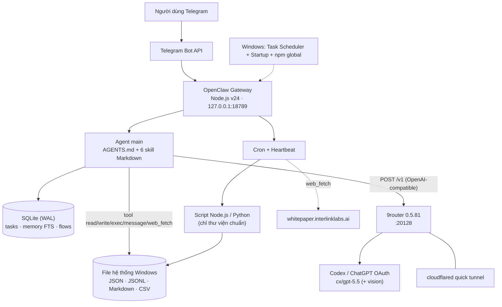

# CÔNG NGHỆ ĐƯỢC SỬ DỤNG — Chatbot hỗ trợ khách hàng InterLink

- Ngày lập: 2026-09-20
- Mục đích: liệt kê công nghệ hiện tại làm đầu vào để chọn stack cho hệ thống mới.

**Hai mức bằng chứng**

| Nhãn | Nghĩa |
|---|---|
| **[Repo]** | Xác minh trực tiếp từ file trong repo này (mã, prompt, cấu hình) |
| **[Báo cáo]** | Lấy từ `docs/SYSTEM_ARCHITECTURE_REPORT.md`, tức audit máy chạy thật `C:\Users\admin\.openclaw` ngày 2026-09-19. Repo này không chứa các thành phần đó (gateway, 9router, SQLite…). Trong báo cáo còn nhãn con: C = đã xác minh, I = suy luận |

---

## 1. Tóm tắt

Hệ thống **không phải** web app có frontend, backend và database truyền thống. Đây là một **AI-agent gateway** chạy trên **một máy Windows**:

```
Telegram → OpenClaw Gateway (Node.js) → Agent (prompt + skill markdown) → LLM qua proxy 9router → Codex/ChatGPT OAuth
                         └→ đọc/ghi file JSON, Markdown, JSONL trên đĩa; SQLite nội bộ của OpenClaw
```

Nghiệp vụ nằm trong **prompt và file markdown**. Code viết tay chỉ là các **script vận hành nhỏ** (Node.js và Python), **không dùng thư viện bên thứ ba**.

---

## 2. Công nghệ theo từng lớp

### 2.1 Kênh giao tiếp

| Công nghệ | Vai trò | Nguồn |
|---|---|---|
| **Telegram Bot API** | Kênh duy nhất đang bật; nhận/gửi tin, nhắn admin, broadcast | [Repo] `AGENTS.md` (`message` tool, `channel: "telegram"`); [Báo cáo] `channels.telegram` |
| Cơ chế nhận tin | Nhiều khả năng **long-polling** (có file `update-offset`), không cần webhook hay domain | [Báo cáo, I] |
| Định dạng tin ra | Markdown rồi OpenClaw chuyển sang HTML an toàn của Telegram; giới hạn 4.096 ký tự/tin | [Repo] `admin-console/SKILL.md` |

### 2.2 Nền tảng agent (xương sống)

| Công nghệ | Vai trò | Nguồn |
|---|---|---|
| **OpenClaw** (gateway, phiên bản 2026.4.8; có bản mới 2026.9.4) | Nhận tin, quản lý session, chạy agent loop, gọi tool, lập lịch cron, tự nạp `AGENTS.md`/`SOUL.md`/`MEMORY.md` vào prompt | [Báo cáo, C]; [Repo] mọi file tên `openclaw-session-*.html` và đường dẫn `.openclaw` |
| **Agent `main`** | Một agent duy nhất, chạy luật trong `AGENTS.md` và các skill | [Báo cáo, C] |
| **Skill = file Markdown có YAML frontmatter** (`name`, `description`) | Đóng gói tri thức và luật trả lời; 6 skill, không có code | [Repo] `skills/*/SKILL.md` |
| **Bộ tool của agent** | `read`, `write`, `exec`, `process`, `web_search`, `web_fetch`, `cron`, `message`. Tool profile `coding`, sandbox tắt | [Repo] tên tool trong `AGENTS.md` và `whitepaper-sync/SKILL.md`; [Báo cáo, C] profile và sandbox |
| **Heartbeat** | Cơ chế OpenClaw gọi agent định kỳ theo `HEARTBEAT.md`; trả `HEARTBEAT_OK` khi không có gì | [Repo] `AGENTS.md`, `HEARTBEAT.md` |
| **Session** | Khoá theo từng user (`per-channel-peer`), debounce 2 giây, reset sau 180 phút im lặng, tối đa 50 lượt đồng thời | [Báo cáo, C] |

### 2.3 Mô hình AI

| Công nghệ | Vai trò | Nguồn |
|---|---|---|
| **LLM: `cx/gpt-5.5`** (mặc định) | Hiểu ý, chọn template, dịch, viết ngắn | [Báo cáo, C] `agents.defaults.model` |
| **Vision của LLM** (đa phương thức) | Đọc ảnh chụp màn hình, không dùng engine OCR riêng | [Repo] `image-reader/SKILL.md` ("dùng vision capability") |
| **9router 0.5.81** (proxy tương thích OpenAI, cổng `20128`) | Đứng giữa gateway và LLM; gom 5 kết nối OAuth Codex, chia vòng (round-robin) | [Báo cáo, C]; [Repo] `9router_check.txt` (kết quả `GET /v1/models`) |
| **Codex / ChatGPT OAuth** | Nguồn quota LLM thực tế phía sau 9router | [Báo cáo, I] |
| Giao thức gọi | `POST /v1` kiểu `openai-completions` tới `localhost:20128` | [Báo cáo, C] |

Lưu ý: `9router_check.txt` liệt kê model tới `cx/gpt-5.4`, **không có** `gpt-5.5` là model mặc định, khớp với phát hiện "khai báo model lệch thực tế" trong báo cáo.

### 2.4 Lưu trữ dữ liệu

| Công nghệ | Dùng cho | Nguồn |
|---|---|---|
| **JSON theo từng user** | Trạng thái antispam và context (`memory/antispam/{uid}.json`, `memory/contexts/{uid}.json`) | [Repo] `AGENTS.md`; số file: [Báo cáo] |
| **JSONL** | Transcript hội thoại của OpenClaw; bản ghi usage `reports/usage-daily.jsonl` | [Repo] `usage-aggregator.mjs`; [Báo cáo] |
| **Markdown** | Log hội thoại theo tháng, tri thức, luật, thống kê tuần trong `MEMORY.md` | [Repo] |
| **CSV** | Xuất báo cáo usage; log broadcast | [Repo] `admin-console/SKILL.md`; [Báo cáo] |
| **SQLite (WAL)** | `tasks/runs.sqlite` (sổ cái cron), `memory/main.sqlite` (chỉ mục full-text, model `fts-only`), `flows/registry.sqlite` (rỗng), và DB riêng của 9router (~516 MB) | [Báo cáo, C] |
| **Hệ thống file Windows** | Nơi duy nhất chứa mọi dữ liệu, gồm ~11.000 ảnh user gửi (`media/inbound/`) | [Báo cáo, C] |
| **HTML** | Xuất phiên chat của OpenClaw (`openclaw-session-*.html`, 49 file trong git) | [Repo] |

Khoá tương tranh: file `.lock` cho session và gateway, WAL cho SQLite. File JSON theo user là read-modify-write **không có khoá**. [Báo cáo, I]

### 2.5 Lập lịch và tác vụ nền

| Công nghệ | Vai trò | Nguồn |
|---|---|---|
| **OpenClaw cron** (`cron/jobs.json`) | 3 job: `usage-aggregator-daily` (hàng giờ), `whitepaper-weekly-sync` (Chủ nhật), `daily-escalate-threshold-alert` (23:59 Asia/Bangkok). Mỗi lần chạy là **một lượt agent gọi LLM**, không chạy script trực tiếp | [Báo cáo, C]; [Repo] mô tả trong `AGENTS.md` |
| **Windows Task Scheduler** | Tự khởi động gateway khi đăng nhập (task "OpenClaw Gateway") | [Báo cáo, C] |
| **Thư mục Startup của Windows** | `OpenClaw Gateway.cmd`, `9router.vbs` | [Báo cáo, C] |
| **Heartbeat + script** | Thống kê tuần, dọn dẹp antispam/context, kiểm tra sync whitepaper | [Repo] `HEARTBEAT.md`, `scripts/heartbeat-*` |

### 2.5b Mạng và truy cập từ ngoài

| Công nghệ | Vai trò | Nguồn |
|---|---|---|
| **cloudflared** (Cloudflare quick tunnel) | Mở URL công khai `*.trycloudflare.com` trỏ tới 9router `:20128` | [Báo cáo, C] |
| Gateway `127.0.0.1:18789` | Chỉ nghe loopback, xác thực bằng token | [Báo cáo, C] |
| **Không** có reverse proxy, domain riêng, TLS tự quản | | [Báo cáo, C] |

### 2.6 Ngôn ngữ lập trình và thư viện

Số file theo loại trong git ([Repo]): **Python 16**, **JavaScript 13**, **`.mjs` 6**, Markdown 19, HTML 49.

| Ngôn ngữ | Dùng để | Thư viện (chỉ thư viện chuẩn) | Nguồn |
|---|---|---|---|
| **Node.js (ESM `.mjs` và CJS `.js`)** | `usage-aggregator.mjs`, các script heartbeat, đếm escalation, dịch báo cáo tháng 9 | `fs`, `fs/promises`, `path`, `readline`, `url`, `node:*` | [Repo] |
| **Python 3.11** | Đếm escalation, kiểm tra heartbeat, thống kê | `json`, `glob`, `re`, `datetime`, `pathlib`, `collections.Counter`, `zoneinfo` | [Repo]; phiên bản: [Báo cáo, C] |
| Runtime Node | v24.14.0 (yêu cầu ≥ 22.14) | | [Báo cáo, C] |

**Không có** `package.json`, `requirements.txt`, `pyproject.toml`, lockfile hay bất kỳ dependency nào trong repo. [Repo]

### 2.7 Hạ tầng và vận hành

| Công nghệ | Chi tiết | Nguồn |
|---|---|---|
| **Windows** | Một máy cá nhân, không staging, không môi trường thứ hai (máy đang audit chạy Windows 11) | [Báo cáo, C] |
| **npm global** | Cài `openclaw` và `9router`, cập nhật thủ công | [Báo cáo, C] |
| **Biến môi trường Windows (User)** | `TELEGRAM_BOT_TOKEN`, `NINE_ROUTER_API_KEY`, `OPENCLAW_GATEWAY_TOKEN`; cấu hình tham chiếu qua `{source:"env"}` | [Báo cáo, C] |
| **Git + GitHub** | Repo hiện tại có remote `github.com/SofinHolding/bot-support` (báo cáo kiến trúc ghi remote khác là `lamvbg/interlinkv2` cho thư mục gốc `.openclaw`) | [Repo] `git remote -v`; [Báo cáo] |
| Sao lưu | `workspace-backup.zip`, `workspace.7z` (thủ công) | [Báo cáo, C] |
| Cấu hình | Sửa tay `openclaw.json` (kèm các bản `.bak`) | [Báo cáo, C] |

### 2.8 Nguồn dữ liệu ngoài

| Dịch vụ | Dùng để | Nguồn |
|---|---|---|
| `whitepaper.interlinklabs.ai` | Đồng bộ nội dung whitepaper qua `web_fetch` | [Repo] `whitepaper-sync/SKILL.md` |
| Google Drive | Lưu video/ảnh demo, chỉ được nhúng dưới dạng link trong template | [Repo] `AGENTS.md`, `SKILL.md` |
| Google Forms | Form nộp task Ambassador | [Repo] `ambassador-program.md` |
| X (Twitter), Telegram nhóm/kênh | Link theo dõi tin dự án và cộng đồng | [Repo] `AGENTS.md`, `SKILL.md` |

---

## 3. Phiên bản đã biết

| Thành phần | Phiên bản | Nguồn |
|---|---|---|
| OpenClaw | 2026.4.8 (đã có 2026.9.4) | [Báo cáo, C] |
| 9router | 0.5.81 (`start-9router.cmd` từng ghim 0.5.45 vì lỗi 401) | [Báo cáo, C] |
| Node.js | v24.14.0 | [Báo cáo, C] |
| Python | 3.11 | [Báo cáo, C] |
| LLM mặc định | `9router/cx/gpt-5.5` | [Báo cáo, C] |

---

## 4. Công nghệ KHÔNG dùng

Đã tìm trong repo và báo cáo, không thấy dấu vết:

| Loại | Kết quả |
|---|---|
| Web frontend / API riêng | Không có. Có `canvas/index.html` và `gateway.controlUi` của OpenClaw, chưa rõ cách dùng ([Báo cáo]) |
| Cơ sở dữ liệu quan hệ (Postgres, MySQL) | Không |
| Redis / cache / message queue | Không. `delivery-queue` là hàng đợi nội bộ của OpenClaw |
| Vector DB / embedding / RAG | Không. Chỉ mục bộ nhớ là full-text (`fts-only`) |
| Docker, docker-compose, nginx, pm2 | Không |
| CI/CD (`.github`) | Không |
| ORM, migration, framework web | Không |
| Test tự động, linter, formatter | Không thấy |
| Giám sát, health-check riêng, log tập trung | Không. Chỉ có `commands.log`, `config-audit.jsonl` và transcript |
| Engine OCR riêng | Không. Dùng vision của LLM |

---

## 5. Ghi chú khi đối chiếu

1. **Repo này chỉ là một phần**: chứa workspace của agent (prompt, skill, script, tri thức). Phần chạy thật (OpenClaw, 9router, SQLite, cloudflared, Task Scheduler) nằm ngoài repo, chỉ biết qua báo cáo.
2. **Đường dẫn bị cứng**: script Node và Python ghi cứng `C:/Users/admin/.openclaw/...` và cả ngày tháng (ví dụ `2026-06-01`, `2026-09-14`), nên không chạy lại được trên máy khác nếu không sửa. [Repo] `scripts/heartbeat-runner.mjs`, `count_escalations.py`
3. **Logic trùng lặp**: ~37 script dùng một lần ở thư mục gốc (`count_escalation*`, `heartbeat*`, `tmp*`) cùng làm một việc với nhiều biến thể. [Repo]
4. **Phụ thuộc vào một nhà cung cấp LLM và một máy chủ**: hết quota OAuth hoặc máy tắt thì bot và cả cron cùng dừng. [Báo cáo]
5. **Rủi ro bảo mật của stack** (DM mở cho mọi người, agent có `exec`/`write` với sandbox tắt, 9router bind `0.0.0.0` kèm tunnel công khai) được phân tích chi tiết ở mục 14 của báo cáo kiến trúc.

---

## 6. Sơ đồ stack


