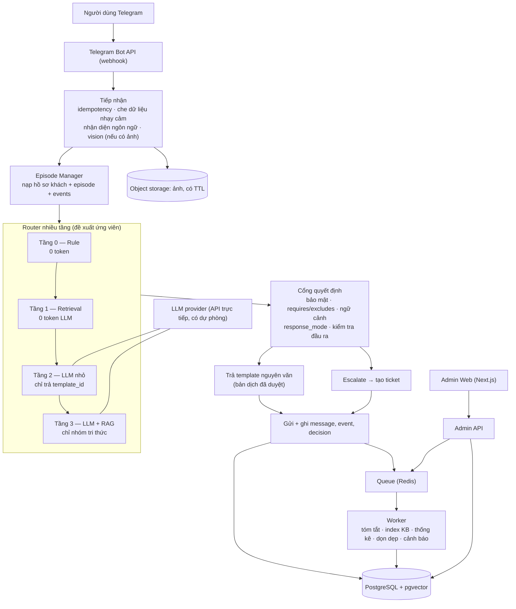
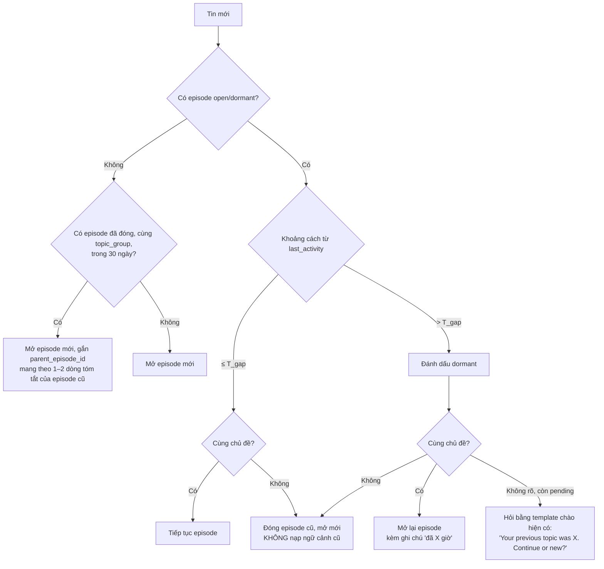

# ĐỀ XUẤT KIẾN TRÚC MỚI — Chatbot hỗ trợ khách hàng InterLink

- Ngày lập: 2026-09-20 (bản hợp nhất sau review)
- Đầu vào: [mo_ta.md](mo_ta.md), [boi_canh_chuyen_gia.md](boi_canh_chuyen_gia.md), [cong_nghe.md](cong_nghe.md), [SYSTEM_ARCHITECTURE_REPORT.md](SYSTEM_ARCHITECTURE_REPORT.md).
- Bốn mục tiêu của chủ hệ thống:
  1. Giảm token mỗi lượt hỏi.
  2. Trang quản trị web cho Admin xem lịch sử thay vì gõ lệnh.
  3. Admin tự nạp dữ liệu (file `.md`) không cần lập trình viên.
  4. Dữ liệu tăng nhưng câu trả lời không chậm, không lệch khỏi ràng buộc bắt buộc.

**Mục lục:** 1 Kết luận · 2 Kiến trúc · 3 Xử lý một tin nhắn · 4 Tri thức và RAG · 5 Trí nhớ và ngữ cảnh · 6 Admin Web · 7 Bảo mật · 8 Vận hành và chất lượng · 9 Mô hình dữ liệu · 10 Lộ trình · 11 Phạm vi không làm · Phụ lục

---

## 1. Kết luận ngắn

| Câu hỏi | Trả lời |
|---|---|
| Hệ thống mới là loại gì? | **Nền tảng hỗ trợ khách hàng có kiểm soát**: router lai (rule + retrieval + LLM) đứng sau một cổng quyết định nghiệp vụ. Không phải multi-agent, và với ràng buộc "trả lời nguyên văn" thì đó là lựa chọn đúng |
| Có nên dùng RAG thay cho việc nhét dữ liệu vào SKILL? | **Có, nhưng RAG dùng để *tìm và chọn* template, không phải để LLM *viết lại* câu trả lời.** LLM chỉ được sinh câu ở nhóm tri thức tham khảo (whitepaper), có trích dẫn và bộ lọc |
| Vấn đề token lớn nhất ở đâu? | Không ở dữ liệu, mà ở chỗ **mọi tin đều đi qua LLM** với system prompt ~80–100K ký tự (`AGENTS.md` 24 KB + `MEMORY.md` 54 KB + skill) và cả transcript. Ví dụ trong `admin-console/SKILL.md` cho thấy ~30K token/request, kể cả câu "hi" |
| Giải pháp cốt lõi | **Router nhiều tầng trước LLM** + **Cổng quyết định**. `AGENTS.md` tự ước tính FAST-PATH chiếm ~80% case; nếu đúng, phần đó về 0 token. Đây là **giả thuyết chưa đo**, kiểm chứng ở giai đoạn shadow (mục 8.3) |
| Ai quyết định được trả lời gì? | **Code, không phải LLM và không phải điểm tương đồng.** LLM chỉ phân loại; điểm khớp chỉ để xếp hạng |
| Giữ OpenClaw không? | **Không.** Nghiệp vụ thực tế là khớp mẫu → trả template → ghi trạng thái. OpenClaw đem lại `exec`/`write` không sandbox, cron gọi LLM chỉ để chạy script, và prompt khổng lồ |
| Dữ liệu ở đâu? | **PostgreSQL + `pgvector`** thay 20.000 file JSON và log markdown. Một DB cho hội thoại, ticket, template, KB, usage |

---

## 2. Kiến trúc mục tiêu



Ba khối triển khai, mở rộng độc lập, chạy trên một Docker Compose:

1. **Bot Service** — xử lý tin nhắn. Stateless, scale ngang được.
2. **Admin Web + API** — quản trị, nạp dữ liệu, xem lịch sử, dashboard.
3. **Worker** — việc nền qua queue. Không gọi LLM chỉ để "chạy script" như cron hiện tại.

Bên trong Bot Service chia module có interface rõ, để sau này tách service hoặc cắm thêm thành phần mà không viết lại:

`TelegramAdapter` → `Normalizer` → `EpisodeManager` → `Router` → `DecisionGate` → `ResponseResolver` → `Escalation` → `Delivery`

---

## 3. Xử lý một tin nhắn

### 3.1 Nguyên tắc

- **Luật và ràng buộc nằm trong code**, không nằm trong prompt: FP-0, anti-spam, phân quyền, giới hạn 4.096 ký tự, whitelist URL. LLM không thể "quên" chúng.
- **Tri thức nằm trong DB**, chỉ nạp phần liên quan vào prompt khi thật sự cần.
- **System prompt cố định và ngắn** (mục tiêu < 2.000 token), bật prompt caching của nhà cung cấp.
- **Điểm khớp không phải quyền trả lời.** Router đề xuất, Cổng quyết định mới cho phép gửi.
- **Thiên về an toàn.** Trả sai template tốn hơn escalate thừa, nên các ngưỡng đặt lệch về phía escalate.

### 3.2 Đường đi của một tin

| Bước | Module | Việc làm | Gọi LLM? |
|---|---|---|---|
| 1 | `TelegramAdapter` | Kiểm tra secret token của webhook; ghi `telegram_update_id` (unique). Update đã xử lý → trả 200 và bỏ qua | Không |
| 2 | `Normalizer` | **Che dữ liệu nhạy cảm** (mục 7.2); nhận diện ngôn ngữ bằng thư viện; nếu có ảnh → vision trả JSON (`screen_type`, `error_text`, `has_secret`) | Chỉ khi có ảnh |
| 3 | `EpisodeManager` | Nạp hồ sơ khách, episode đang mở và các event của nó; quyết định cùng hay khác chủ đề (mục 5) | Không |
| 4 | `Router` | Tầng 0 → 1 → 2 → 3, dừng ở tầng đầu tiên cho ra ứng viên đủ tốt (mục 3.3) | Tầng 2–3 |
| 5 | `DecisionGate` | Sáu cổng theo thứ tự (mục 3.4). Ghi bản ghi `decisions` kèm lý do | Không |
| 6 | `ResponseResolver` | Lấy bản dịch đã duyệt theo `(template_id, lang)`; chưa có thì dịch một lần rồi lưu chờ duyệt | Hiếm |
| 7 | `Escalation` | Nếu ESCALATE: gửi template FP-12, tạo ticket gắn mã lỗi và PIC | Không |
| 8 | `Delivery` | Gửi với `dedupe_key`; ghi `messages`, `episode_events`; cập nhật episode; đẩy job nền | Không |

### 3.3 Các tầng của router

| Tầng | Xử lý gì | Cách làm | Token LLM |
|---|---|---|---|
| **0 — Rule** | FP-0, chào/sticker/emoji, `/start`, đang bị block, prompt injection, follow-up ngắn ("thanks", "ok", "no") | Regex + máy trạng thái đọc `episode_events` | 0 |
| **1 — Retrieval** | 17 FAST-PATH và ~45 template của SKILL | Embedding câu hỏi so với **câu hỏi mẫu** của từng template; hybrid vector + BM25 | 0 |
| **2 — LLM nhỏ** | Câu mơ hồ, hoặc tầng 1 chưa đủ tự tin | Gửi top-5 ứng viên + gói ngữ cảnh (mục 5.5). Bắt buộc trả JSON gồm `template_id` hoặc `ESCALATE`, `confidence`, `language`. Không được viết câu trả lời | ~1–3K |
| **3 — LLM + RAG** | Câu hỏi thuộc nhóm tri thức tham khảo (whitepaper, dự án) | Truy xuất 3–5 chunk, trả lời có trích dẫn, qua bộ lọc đầu ra (mục 4.4) | ~3–6K |

Ước lượng thiết kế, chưa đo: hiện ~30K token/lượt cho mọi tin; sau khi tách tầng, phần lớn tin tốn 0 token, phần còn lại 2–5K. Mục tiêu **không phải** tối đa hoá tỉ lệ 0-token mà là giảm chi phí trong khi giữ ngưỡng chất lượng ở mục 8.3.

### 3.4 Cổng quyết định (Decision Gate)

Một module duy nhất `decide(candidate, context) → decision`. Mọi ứng viên, kể cả từ tầng 0, đều đi qua. Các bước là **cổng đúng/sai theo thứ tự**, không phải điểm cộng có trọng số.

| # | Cổng | Ví dụ lấy từ luật hiện có |
|---|---|---|
| 1 | **Bảo mật** | Tin có seed/key → cảnh báo FP-0 cố định. User đang bị block → từ chối |
| 2 | **Điều kiện của template**: `requires` và `excludes` | FP-6 bị loại nếu khách nhắc email KYC (nhường FP-5b) hoặc đã xong level 1 (nhường FP-6b). Đây chính là các dòng "⛔ KHÔNG match nếu" trong `AGENTS.md` |
| 3 | **Tương thích ngữ cảnh** | Sau template burn, tin "not burn" → ESCALATE. Ảnh KYC có `overrides_context` → bỏ qua issue cũ. Episode cũ cùng chủ đề đã escalated → escalate sớm (mục 5.4) |
| 4 | **`response_mode`** | Template `EXACT_TEMPLATE` không bao giờ qua LLM sinh câu (mục 4.1) |
| 5 | **Xếp hạng** ứng viên còn lại bằng điểm hybrid | `MATCH_CONFIDENT` → gửi. `MATCH_AMBIGUOUS` → xuống tầng 2. `NO_MATCH` → tầng 3 nếu thuộc nhóm tri thức, còn lại ESCALATE |
| 6 | **Kiểm tra đầu ra** | URL trong whitelist, ≤ 4.096 ký tự; với câu sinh thêm bộ lọc giá/ROI/công thức HCS |

- Tầng 2 vẫn mơ hồ → **ESCALATE**, đúng luật hiện tại "phân vân → escalate". Chế độ "hỏi lại khách một câu" mặc định tắt, vì luật hiện nay cấm hỏi thêm ở nhiều case (ảnh); bật hay không do chủ hệ thống quyết.
- Mỗi quyết định ghi vào `decisions`: ứng viên, cổng nào loại ai, lý do. Admin Web hiển thị "vì sao bot trả lời thế này".
- Vì sao dùng cổng thay cho công thức cộng nhiều tín hiệu: cổng đọc được, test được từng cái, và admin hiểu được khi sửa template. Tổng có trọng số thì không ai giải thích nổi vì sao 0.84 thắng 0.81.
- Quy mô hiện tại (~60 template, ~15 luật) chưa cần engine policy tổng quát như OPA hay Cedar. Điều quan trọng đã đạt: mọi luật ở một chỗ, một interface, có log lý do.

### 3.5 Các tối ưu token khác

| Việc | Hiện tại | Đề xuất |
|---|---|---|
| Nhận diện ngôn ngữ | LLM đọc bảng luật | Thư viện (`lingua`, `franc`, `fastText lid`), vài mili giây |
| Dịch template | LLM dịch mỗi lần | Dịch **một lần**, lưu theo `(template_id, lang)`, admin duyệt |
| Ảnh | Vision với prompt dài | Chỉ gọi khi có ảnh; resize ≤ 1024 px; prompt ngắn, trả JSON |
| Lịch sử hội thoại | Transcript đầy đủ mỗi lượt | Gói ngữ cảnh kích thước gần cố định (mục 5.5) |
| `MEMORY.md` 97K ký tự | Bị cắt, vẫn nạp mỗi lượt | Bỏ khỏi prompt. Thống kê chuyển sang bảng DB |
| Cron | Agent gọi LLM ~30 s để `exec` script | Worker chạy trực tiếp |
| Chọn model | Một model lớn cho mọi việc | Model nhỏ cho tầng 2 và tóm tắt, model lớn chỉ cho tầng 3 |
| Lạm dụng | Không có hạn mức | Anti-spam chạy **trước** mọi lời gọi LLM; hạn mức token theo user và theo ngày |

---

## 4. Tri thức và RAG

### 4.1 `response_mode`: nội dung được phép dùng thế nào

Khác với RAG hỏi đáp tài liệu thông thường: ở đây **kết quả tìm kiếm là câu trả lời**, LLM chỉ làm trọng tài khi tìm kiếm chưa chắc. Mỗi template và mỗi tài liệu KB **bắt buộc** khai `response_mode`, để khi admin tải một file lên, hệ thống biết cả nội dung lẫn cách được phép dùng nó.

| `response_mode` | Dùng cho | Xử lý | LLM sinh câu? | Ai sửa được |
|---|---|---|---|---|
| `SECURITY_RULE` | FP-0, anti-spam, chống injection, bộ lọc đầu ra | Code + cấu hình được bảo vệ | Không | Chỉ owner, cần người thứ hai duyệt (mục 6.3) |
| `EXACT_TEMPLATE` | 17 FAST-PATH, ~45 mục SKILL, luật follow-up | Khớp → trả bản dịch đã duyệt | Không | Admin, qua Draft → Publish |
| `GROUNDED_GENERATION` | whitepaper, infrastructure, ambassador | RAG, bắt buộc trích dẫn, qua bộ lọc | Có, trong giới hạn | Admin, qua Draft → Publish |
| (không có nguồn) | Mọi thứ còn lại | ESCALATE | Không tự đoán | — |

### 4.2 Cấu trúc một template

Admin nạp file `.md`; hệ thống parse theo heading thành bản ghi. Trang admin có form nhập nên không cần nhớ cú pháp.

```yaml
id: kyc-email-but-queue           # ổn định, dùng làm khoá
group: KYC                        # cũng là topic_group của episode
response_mode: EXACT_TEMPLATE
priority: 90                      # cao hơn = ưu tiên khi trùng
match:
  keywords: ["got mail", "still in queue", "nhận email xác minh"]
  examples:                       # câu hỏi mẫu, dùng tạo embedding
    - "I got the verification email but app still says in queue"
    - "nhận email rồi mà app vẫn chờ"
  image_types: [kyc_email, kyc_queue_screen]
  requires: []                    # điều kiện bắt buộc
  excludes: []                    # vd FP-6: [mentions_kyc_email, completed_level_1]
  overrides_context: true         # tương đương FP-5b HIGHEST PRIORITY
answer:
  en: "That's just a notification email. Please monitor..."
  vi: "..."                       # dịch sẵn, admin duyệt
follow_up:
  thanks: you-are-welcome
  more_images: kyc-email-but-queue
  negative: ESCALATE
sets_context:
  issue: "kyc notification email pending"
  status: pending
```

### 4.3 Thành phần kỹ thuật

| Thành phần | Đề xuất | Lý do |
|---|---|---|
| Vector store | **`pgvector` trong PostgreSQL** | KB nhỏ: vài trăm template, vài chục tài liệu, vài nghìn chunk. Một DB, một backup. Chỉ cân nhắc Qdrant/Weaviate khi số đo (P95, RAM, tranh chấp với transaction nghiệp vụ) cho thấy cần |
| Embedding | Model **đa ngôn ngữ**: `bge-m3` (self-host) hoặc `text-embedding-3-large` / `voyage-multilingual` (API) | Khách nhắn bằng ≥ 17 ngôn ngữ |
| Tìm kiếm | **Hybrid**: vector + BM25 (`tsvector`), gộp bằng RRF | Từ khoá sản phẩm (ITLG, HHP, HCS) cần khớp chính xác; vector tốt cho cách diễn đạt khác nhau |
| Rerank | Tuỳ chọn, cross-encoder (`bge-reranker`) cho tầng 3 | Không cần cho template |
| Chunking | Theo heading `##`/`###`, 200–500 token, kèm metadata | Khớp cách các file `.md` hiện có được viết |
| Điểm tương đồng | Chỉ để **xếp hạng** ứng viên đã qua cổng. Ngưỡng hiệu chỉnh từ bộ test **theo từng embedding model và ngôn ngữ**, lưu kèm `embedding_version` | Không có con số phổ quát; đổi model là phải hiệu chỉnh lại |
| Phiên bản | Mỗi chunk lưu `chunk_hash`, `embedding_model`, `embedding_version`, `document_version_id` | Đổi model hoặc cách chunk thì re-index có kiểm soát, chỉ embed lại chunk có hash đổi |

### 4.4 Guardrail cho câu sinh (tầng 3)

- Chỉ dùng nội dung trong chunk truy xuất; bắt buộc kèm link nguồn.
- Nội dung KB và tin của khách luôn nằm trong vùng "dữ liệu" của prompt, không phải vùng chỉ dẫn.
- Bộ lọc đầu ra: cấm số liệu giá/ROI/ngày niêm yết cụ thể, URL ngoài whitelist, công thức HCS; giới hạn độ dài.
- Vi phạm → thay bằng template FP-12, ghi log. Vi phạm nhiều ở một chủ đề → chuyển chủ đề đó sang `EXACT_TEMPLATE`.

---

## 5. Trí nhớ và ngữ cảnh

"Nhớ" ở đây không phải cơ chế AI. Nó là **tra cứu theo khoá trong DB** rồi **đóng gói đúng phần cần** cho bước đang xử lý. Tìm kiếm vector chỉ dùng cho tri thức (mục 4); trí nhớ về một khách thì nhỏ và có khoá rõ, nên tra theo `user_id` vừa nhanh vừa không bao giờ lấy nhầm của người khác.

### 5.1 Ba loại trí nhớ

| Loại | Lưu ở đâu | Ai ghi | Ai đọc |
|---|---|---|---|
| **Hồ sơ khách**: ngôn ngữ, cờ (từng bị cảnh báo FP-0, từng bị block, ticket đang mở), 3–5 episode gần nhất (`issue`, `status`, ngày) | `users`, `episodes` | Code | Mọi tầng |
| **Trạng thái vấn đề đang xử lý**: template đã gửi, ảnh đã nhận, đang chờ gì, đã tạo ticket chưa | `episodes`, `episode_events` | **Code, ghi tức thời** | Tầng 0–1, Cổng quyết định |
| **Nội dung hội thoại**: khách đã kể gì | `messages`, `episodes.summary` | Code ghi tin; **LLM viết tóm tắt** | Chỉ tầng 2–3 |

Nguyên tắc phân vai: **quyết định nghiệp vụ dựa trên `episode_events`** (luôn đúng vì do code ghi). Tóm tắt do LLM viết chỉ giúp LLM hiểu ngữ cảnh; nó sai hay thiếu cũng không làm sai quyết định.

Cố ý **không nhớ**: Interlink ID, email, nội dung ảnh KYC, thông tin cá nhân khác. Hệ thống hiện có luật cấm lưu những thứ này, và PII tích tụ đang là rủi ro mức Cao trong báo cáo kiến trúc.

### 5.2 Episode

Một **episode** là một vấn đề của một khách, từ lúc mở tới lúc xong. Một khách có nhiều episode nối tiếp; `contexts/{uid}.json` hiện nay chỉ giữ một ngữ cảnh và bị ghi đè.

| Trường | Ý nghĩa |
|---|---|
| `issue`, `topic_group` | Vấn đề và nhóm (Account / KYC / Wallet / Mining / FAQ…), lấy từ template đã khớp |
| `status` | `open` · `dormant` (im lặng quá ngưỡng, chưa xong) · `resolved` · `escalated` |
| `parent_episode_id` | Episode cũ cùng chủ đề mà episode này nối tiếp (mục 5.4) |
| `summary`, `summary_upto_message_id` | Tóm tắt cuộn và mốc nó đã bao phủ |
| `last_template_id`, `last_activity_at` | Cho luật follow-up và tính khoảng cách thời gian |

### 5.3 Quyết định khi có tin mới



"Cùng chủ đề?" quyết bằng ba tín hiệu, theo thứ tự:

| # | Tín hiệu | Kết luận |
|---|---|---|
| 1 | Tin ngắn/phủ định/cảm ơn, hoặc là câu trả lời cho thứ bot vừa hỏi, hoặc ảnh cùng `image_type` với episode | **Cùng** (luật follow-up hiện có trong `AGENTS.md`) |
| 2 | Khách nói rõ đổi chủ đề ("new question", "vấn đề khác", "forget that") | **Khác** |
| 3 | Tầng 1 chọn được template có `topic_group` khác, điểm cao, và tin mới ít giống `issue`/`summary` của episode | **Khác** |
| — | Không rơi vào 1–3 | Trong `T_gap`: **cùng** (giữ nguyên tắc "phân vân → follow-up"). Ngoài `T_gap` và còn pending: **hỏi** |

### 5.4 Khách quay lại sau khi episode đã đóng

Ví dụ: episode KYC đã `escalated` 10 ngày trước, nay khách nhắn "my KYC still not done". Nếu chỉ mở episode trắng, bot sẽ lặp lại chuỗi template từ đầu.

- Khi mở episode mới, tra các episode đã đóng trong 30 ngày có cùng `topic_group`. Có thì gắn `parent_episode_id` và mang theo 1–2 dòng tóm tắt.
- Episode cha đã `escalated` → Cổng quyết định (cổng 3) **escalate sớm** và ghi vào ticket cũ thay vì tạo ticket mới.
- Episode cha `resolved` → xử lý bình thường, nhưng gói ngữ cảnh có dòng "từng gặp vấn đề này, đã xong ngày X".

### 5.5 Gói ngữ cảnh gửi LLM

Chỉ dựng khi tin rơi xuống tầng 2–3. Ví dụ khách đã nhắn 14 lượt về KYC, giờ gửi "I did everything you said, what now?":

```
[Hồ sơ]    lang=en · episode trước: "change email" (resolved, 3 ngày trước)
[Sự kiện]  template_sent: how-to-kyc → kyc-email-but-queue → kyc-speed-up
           image_received: kyc_queue_screen ×2            ← code ghi, luôn đúng
[Tóm tắt]  Khách đã match curator, nhận email thông báo, app vẫn queue 5 ngày,
           đã thử tăng mining rate theo video.            ← LLM viết, tin 1–10
[Gần đây]  tin 11–14 nguyên văn                           ← chưa kịp tóm tắt
[Tin mới]  "I did everything you said, what now?"
[Ứng viên] top-5 template từ tầng 1
```

Khoảng 400–600 token, gần như không tăng dù khách nhắn 14 hay 140 lượt.

| Tình huống | Ngữ cảnh dùng | Token |
|---|---|---|
| Tin dừng ở tầng 0–1 (đa số) | Không gửi LLM; chỉ đọc `episode_events` | 0 |
| Hỏi liên tục, cùng vấn đề, < K lượt | Toàn bộ lượt của episode | nhỏ |
| Hỏi liên tục, cùng vấn đề, ≥ K lượt | Tóm tắt + lượt sau mốc | gần cố định |
| Quay lại sau lâu, cùng vấn đề | Mở lại: tóm tắt + lượt cuối + ghi chú thời gian | gần cố định |
| Quay lại sau lâu hoặc đổi giữa chừng, khác vấn đề | Episode mới, chỉ mang hồ sơ khách | rất nhỏ |
| Quay lại, không rõ, episode cũ còn pending | Hỏi khách trước | 0 |

### 5.6 Tóm tắt cuộn

| Mục | Quy định |
|---|---|
| Khi nào chạy | **Sau khi đã trả lời**, qua worker, nếu số tin chưa tóm tắt trong episode ≥ K (gợi ý 6). Không nằm trên đường phản hồi |
| Đầu vào | Tóm tắt cũ + các tin chưa tóm tắt (đã che dữ liệu nhạy cảm) |
| LLM viết gì | Chỉ phần **cần hiểu ngôn ngữ**: `issue`, `user_reported` (khách đã kể gì, đã thử gì), `unresolved_points`. JSON, ≤ ~300 token |
| LLM **không** viết | Template đã gửi, loại ảnh đã nhận, đang chờ gì, ticket, trạng thái. Những thứ này lấy từ `episode_events` |
| Truy vết | `summary_version`, khoảng tin nguồn, model, thời điểm. Có event quan trọng hoặc tin mâu thuẫn → tạo lại |
| Chi phí | Model nhỏ, ~1–2K token mỗi lần, chỉ tốn khi episode thật sự dài |

### 5.7 Vòng đời

| Chuyển trạng thái | Điều kiện |
|---|---|
| open → dormant | Im lặng > `T_gap` (gợi ý 60 phút) |
| dormant → open | Khách quay lại cùng chủ đề |
| → resolved | Khách cảm ơn/xác nhận, hoặc template có `sets_context.status = resolved` |
| → escalated | Trả FP-12 / tạo ticket |
| dormant → resolved (tự động) | Im lặng > `T_abandon` (gợi ý 7 ngày, khớp luật dọn context hiện tại). **Không xoá**, chỉ đóng; lịch sử còn cho admin |

`T_gap`, `T_abandon`, K và ngưỡng tương đồng nằm trong `settings`, admin chỉnh được; giá trị khởi điểm lấy từ bộ test.

---

## 6. Admin Web

### 6.1 Chức năng

| Nhóm | Tính năng |
|---|---|
| **Hội thoại** | Danh sách khách; timeline theo từng episode (tin, ảnh, event); với mỗi câu bot trả: tầng router, ứng viên, cổng nào loại ai (từ `decisions`). Tìm theo khách/từ khoá/ngày; lọc pending/escalated |
| **Ticket** | Case escalate tự thành ticket: mã lỗi, PIC, trạng thái, ghi chú. Thay cho việc chỉ gửi link `@interlink_technicalsupport` |
| **Knowledge Base** | Upload `.md`, soạn trực tiếp; xem trước cách parse; Draft → Review → Publish; lịch sử phiên bản; rollback; nút "Thử câu hỏi này" |
| **Template** | Form sửa câu trả lời, `requires`/`excludes`, bản dịch; đánh dấu bản dịch đã duyệt |
| **Dashboard** | Các chỉ số ở mục 8.3, top vấn đề, câu không khớp (để bổ sung KB), token và chi phí |
| **Cấu hình** | Ngưỡng anti-spam, `T_gap`, K, model đang dùng. Không cần deploy lại |
| **Audit log** | Ai sửa gì, khi nào, trước và sau |

### 6.2 Luồng nạp dữ liệu (không cần lập trình viên)

```
Admin upload/soạn .md
→ 1. Kiểm tra cấu trúc: frontmatter hợp lệ, đủ id / group / response_mode / ngôn ngữ
→ 2. Quét an toàn: URL ngoài whitelist, chuỗi giống secret, HTML/script
→ 3. Trùng và mâu thuẫn: examples quá giống template khác; cùng điều kiện nhưng khác đáp án
→ 4. Bản dịch: ngôn ngữ nào thiếu hoặc chưa duyệt
→ 5. Test hồi quy: bao nhiêu câu trong eval_cases đổi đáp án
→ 6. Replay: chạy bản Draft trên tin thật N ngày gần nhất, liệt kê tin sẽ đổi câu trả lời
→ lưu Draft kèm báo cáo 1–6 → người duyệt bấm Publish
→ worker tạo embedding cho phiên bản mới → kích hoạt (không restart) → rollback một nút
```

Bước 5–6 là thứ giữ mục tiêu 4 khi dữ liệu tăng. Replay thay cho canary release: bot có một kênh, lưu lượng nhỏ, chia traffic không đủ mẫu mà vẫn có khách nhận câu sai.

### 6.3 Phân quyền và cấu hình được bảo vệ

| Role | Quyền |
|---|---|
| `owner` | Tất cả, gồm cấu hình được bảo vệ |
| `admin` | Nội dung `EXACT_TEMPLATE` và `GROUNDED_GENERATION`, ticket, cấu hình thường |
| `viewer` | Chỉ xem; ID khách hiển thị dạng che |

Admin Web làm việc sửa dễ hơn, nên phải khoá những thứ không được sửa dễ: luật FP-0, bộ lọc đầu ra, whitelist URL, danh sách admin và quyền, chính sách lưu giữ ảnh. Các mục này chỉ `owner` sửa, **cần người thứ hai duyệt**, luôn ghi audit.

### 6.4 Công nghệ

| Lớp | Đề xuất chính | Phương án thay thế |
|---|---|---|
| Ngôn ngữ | **TypeScript** toàn bộ — đội đang viết Node | Python (`aiogram` + FastAPI) nếu đội quen Python |
| Telegram | `grammY` hoặc `telegraf`, chế độ webhook | `aiogram` |
| API | `Fastify` hoặc `NestJS` | FastAPI |
| ORM | `Prisma` hoặc `Drizzle` (có migration) | SQLAlchemy + Alembic |
| Admin UI | `Next.js` + `shadcn/ui`; hoặc `Refine`/`React-Admin` để dựng nhanh | — |
| Đăng nhập | Email + mật khẩu + 2FA, hoặc Telegram Login Widget | — |
| Queue | `BullMQ` trên Redis | Celery / RQ |
| Storage ảnh | S3-compatible (`MinIO` tự host hoặc S3/R2) | — |
| Soi LLM | `Langfuse` (mã nguồn mở): prompt, token, chi phí, độ trễ từng lượt | — |

---

## 7. Bảo mật

### 7.1 Bảng mối đe doạ

| Mối đe doạ | Đường vào | Kiểm soát |
|---|---|---|
| Prompt injection | Tin nhắn, chữ trong ảnh, **và nội dung `.md` admin tải lên** | KB và tin khách nằm trong vùng dữ liệu của prompt; LLM tầng 2 chỉ trả `template_id`; bộ lọc đầu ra; bot **không có tool nào** để bị lợi dụng |
| Chiếm tài khoản admin | Đăng nhập Admin Web | 2FA, phiên ngắn, cấu hình được bảo vệ cần hai người, audit |
| Rò PII | Log, nhà cung cấp LLM, ảnh KYC, backup | Che dữ liệu ở đầu vào; ảnh có TTL; backup mã hoá; `viewer` thấy bản che |
| Giả mạo / phát lại webhook | Endpoint công khai | Header `X-Telegram-Bot-Api-Secret-Token`, idempotency |
| File tải lên độc hại | Upload `.md` | Chỉ nhận text, giới hạn kích thước, sanitize khi hiển thị |
| Lạm dụng chi phí | Spam để đốt token | Anti-spam trước mọi lời gọi LLM; hạn mức token; cảnh báo khi vượt |
| Lộ secret hệ thống | File cấu hình, backup | Secret trong env/secret manager, tách theo môi trường; không tunnel công khai |

### 7.2 Che dữ liệu nhạy cảm

**Một** module ở đầu vào; mọi thứ phía sau (DB, LLM, tóm tắt, Admin Web) chỉ thấy bản đã che.

- Seed phrase: đối chiếu **danh sách từ BIP39**, chính xác hơn regex.
- Private key, WIF: regex.
- Ảnh: cờ `has_secret` từ vision → không lưu ảnh, chỉ lưu sự kiện.
- Bản ghi chỉ giữ `issue = security-alert-key-leak`, đúng luật FP-0 hiện tại; đồng thời báo owner.

### 7.3 Dữ liệu khách

- Ảnh trong object storage có TTL (gợi ý 7–30 ngày), xoá EXIF.
- Chính sách lưu giữ hội thoại cấu hình được, thuộc cấu hình được bảo vệ.
- Bot Service không có quyền `exec` hay ghi file tuỳ ý.

---

## 8. Vận hành và chất lượng

### 8.1 Độ tin cậy

| Rủi ro | Biện pháp |
|---|---|
| Telegram gửi lại cùng một update → trả lời trùng, ticket trùng | `inbound_updates.telegram_update_id` unique, ghi trong cùng transaction với xử lý. Tin gửi đi có `dedupe_key` |
| Job worker lỗi lặp vô hạn | Retry có giới hạn + backoff; quá số lần → dead-letter queue, cảnh báo |
| Hết quota hoặc nhà cung cấp LLM lỗi | API chính thức + **provider dự phòng**; circuit breaker; cùng lỗi → template "high traffic" hiện có |
| Một máy Windows, không tự hồi phục | Docker Compose trên VPS Linux, restart policy, health-check |
| Log hội thoại ngừng ghi (đang xảy ra) | Ghi DB ngay trong luồng xử lý, không phụ thuộc LLM "nhớ" ghi |
| 20.000 file JSON đọc/ghi không khoá | Bảng trong Postgres; anti-spam đếm bằng Redis `INCR` + TTL, nguyên tử |
| Mất dữ liệu | Backup Postgres hằng ngày, **diễn tập restore trước khi chuyển kênh** |
| Không biết khi nào hỏng | Log JSON có cấu trúc, metric (Prometheus/Grafana hoặc dịch vụ hosted), cảnh báo về Telegram của owner |

### 8.2 SLO khởi điểm

Chốt lại sau giai đoạn shadow. Hiện `AGENTS.md` đặt < 5 s cho FAST-PATH và < 15 s cho 80% case.

| Chỉ tiêu | Mục tiêu khởi điểm |
|---|---|
| Tầng 0–1 | P95 < 2 s |
| Tầng 2 | P95 < 6 s |
| Tầng 3 và tin có ảnh | P95 < 12 s |
| Mất tin / gửi trùng | 0 |

### 8.3 Chỉ số chất lượng và điều kiện chuyển kênh

Đo trong giai đoạn shadow, trên bộ câu hỏi gắn nhãn và trên traffic thật.

| Chỉ số | Ý nghĩa | Vai trò |
|---|---|---|
| Tỉ lệ trả **sai template** | Bot gửi câu không đúng case | **Chặn.** Tốn nhất: khách nhận thông tin sai |
| Bộ test bảo mật (FP-0, injection, secret trong ảnh) | Phải đạt 100% | **Chặn** |
| Tỉ lệ khớp đúng tổng thể | So với nhãn và với bot cũ | Không được kém bot cũ |
| Tỉ lệ escalate thừa | Có template nhưng lại chuyển người | Theo dõi; chấp nhận cao hơn trả sai |
| Tỉ lệ escalate | So với bot cũ (có ngày 217 lượt) | Theo dõi |
| Tỉ lệ không gọi LLM | Kiểm chứng giả thuyết 80% | Thông tin, **không phải mục tiêu** |
| P95 độ trễ theo tầng | So với SLO | Chặn nếu vượt xa |
| Chi phí mỗi episode | Token × giá | Thông tin |
| Số câu sinh bị bộ lọc chặn | Tầng 3 | Cao → siết prompt hoặc chuyển sang `EXACT_TEMPLATE` |

Ngưỡng cho các chỉ số chặn do chủ hệ thống chốt sau số đo đầu tiên. Chưa đạt thì chưa chuyển kênh.

### 8.4 Giữ chất lượng khi dữ liệu tăng

| Rủi ro | Biện pháp |
|---|---|
| Thêm KB làm câu cũ chọn sai template | Bộ test hồi quy (≥ 300 câu thật, gắn nhãn) + replay, chạy khi Publish và trong CI; giảm thì chặn Publish |
| Hai template quá giống nhau | Cảnh báo trùng/mâu thuẫn ở bước 3 của luồng nạp |
| Đổi embedding model làm lệch ngưỡng | Ngưỡng gắn với `embedding_version`; đổi model phải chạy lại bộ test trước khi kích hoạt |
| LLM lệch ràng buộc | Tầng 2 chỉ trả `template_id`; tầng 3 qua bộ lọc; luật ở Cổng quyết định |
| Vector và transaction tranh tài nguyên | Theo dõi P95 truy vấn vector; tách read replica hoặc vector store riêng khi số đo yêu cầu |

---

## 9. Mô hình dữ liệu

| Bảng | Trường chính |
|---|---|
| `users` | `telegram_id`, `name`, `username`, `language`, `role`, `flags jsonb`, `first_seen`, `last_seen` |
| `episodes` | `user_id`, `parent_episode_id`, `issue`, `topic_group`, `status`, `summary jsonb`, `summary_version`, `summary_upto_message_id`, `last_template_id`, `opened_at`, `last_activity_at` |
| `episode_events` | `episode_id`, `type` (template_sent, image_received, info_provided, ticket_created, resolved…), `payload jsonb`, `at`. **Nguồn sự thật cho trạng thái nghiệp vụ** |
| `messages` | `episode_id`, `direction`, `text` (đã che), `image_ref`, `tokens`, `cost`, `latency_ms`, `created_at` |
| `decisions` | `message_id`, `router_tier`, `candidates jsonb`, `gates jsonb`, `final`, `kb_version` |
| `inbound_updates` | `telegram_update_id` (unique), `received_at`, `processed_at`, `status` |
| `tickets` | `episode_id`, `error_code`, `pic`, `status`, `notes` |
| `templates` | `id`, `group`, `response_mode`, `priority`, `match jsonb`, `follow_up jsonb`, `sets_context jsonb`, `version`, `status` |
| `template_translations` | `template_id`, `lang`, `text`, `approved_by` |
| `kb_documents`, `kb_document_versions` | `slug`, `title`, `response_mode`; mỗi phiên bản: `source_md`, `status` (draft/published), `author`, `published_at` |
| `kb_chunks` | `document_version_id`, `chunk_index`, `chunk_hash`, `heading`, `text`, `embedding vector`, `embedding_model`, `embedding_version`, `tsv tsvector`, `status`, `metadata jsonb` |
| `eval_cases` | `question`, `expected_template_id`, `lang`, `source` |
| `usage_daily` | Gộp từ `messages` bằng worker (thay `usage-aggregator.mjs`) |
| `settings`, `protected_settings` | `key`, `value jsonb`; bảng sau cần owner + người duyệt thứ hai |
| `audit_log` | `actor`, `action`, `entity`, `before`, `after`, `at` |
| Redis | `offtopic:{uid}` (đếm, TTL), `block:{uid}` (TTL), hạn mức token, queue |

---

## 10. Lộ trình

| Giai đoạn | Việc | Kết quả |
|---|---|---|
| **0. Chuẩn bị (1–2 tuần)** | Chốt 6 mâu thuẫn ở `mo_ta.md` mục 7. Trích toàn bộ template sang cấu trúc mục 4.2: gắn `response_mode`, chuyển "KHÔNG match nếu" thành `excludes`. Gắn nhãn ~300 câu hỏi thật làm `eval_cases`. Bộ test FP-0 riêng. Rà bảng mối đe doạ | Kho template + bộ test |
| **1. Bot lõi (2–4 tuần)** | Webhook + idempotency, che dữ liệu, `EpisodeManager` tối thiểu (đủ cho follow-up, chưa cần tóm tắt), router tầng 0–2, `DecisionGate`, bảng `decisions`. Chạy **shadow** song song OpenClaw: nhận cùng tin, ghi quyết định, chưa trả lời | Số đo thật cho mục 8.3 |
| **2. Chuyển kênh** | Điều kiện: đạt các chỉ số chặn; backup đã diễn tập restore; cảnh báo đã chạy. Bật bot mới, tắt OpenClaw, nhập `contexts` và `user-index` cũ vào DB | Bot mới vận hành |
| **3. Admin Web (3–4 tuần)** | Hội thoại, ticket, KB với luồng nạp 6 bước, phân quyền, dashboard | Admin không cần lệnh và không cần dev để thêm dữ liệu |
| **4. Tầng 3 và tóm tắt cuộn** | Bật `GROUNDED_GENERATION` cho whitepaper; worker tóm tắt; `parent_episode_id`; chính sách lưu giữ ảnh | Hoàn thiện |

Mỗi giai đoạn dừng lại vẫn dùng được. Không dồn việc "hardening" về cuối: thứ gì có thể làm mất tin hoặc gửi sai cho khách thì phải xong trước giai đoạn 2.

---

## 11. Phạm vi không làm, và khi nào xem lại

| Không làm | Lý do | Khi nào xem lại |
|---|---|---|
| Nhét toàn bộ KB vào system prompt | Chính là nguyên nhân ~30K token/lượt hiện nay | — |
| Để LLM viết câu trả lời cho case đã có template | LLM sẽ sửa vài từ, mất tính nguyên văn | — |
| Framework agent đa năng (OpenClaw, AutoGPT) | Chi phí, độ trễ, rủi ro bảo mật lớn hơn lợi ích cho bài toán phân loại rồi trả mẫu | — |
| Agent Orchestrator, Tool Gateway, agent chuyên trách — kể cả dựng sẵn interface | Bot **không có công cụ nào chạm tới tài khoản khách**: không có API tới backend InterLink, mọi case cần tra cứu đều escalate. Không có tool thì agent không có gì để điều phối | Khi InterLink cấp API chỉ-đọc (trạng thái KYC, lịch trả thưởng). Khi đó: Tool Gateway với danh sách capability cho phép, kiểm quyền ở backend; agent **đề xuất**, `DecisionGate` **quyết** |
| Trí nhớ dài hạn do LLM trích xuất (`user_memories`) | Trái luật hiện có về không lưu thông tin nhạy cảm; thêm chi phí, trách nhiệm pháp lý, và một nguồn sai. Không có nghiệp vụ nào cần ngoài những gì ở mục 5.1 | Khi có nhu cầu cụ thể; chỉ lưu theo **danh sách khoá cho phép**, không trích tự do |
| Engine policy tổng quát (OPA, Cedar, DSL riêng) | ~60 template, ~15 luật; một module `DecisionGate` là đủ | Khi luật vượt ~50, hoặc phục vụ nhiều sản phẩm với policy khác nhau |
| Canary release cho KB | Một kênh, lưu lượng nhỏ; đã có replay | Khi có nhiều kênh hoặc lưu lượng lớn |
| Hỏi lại khách khi mơ hồ | Luật hiện tại: phân vân → escalate, cấm hỏi thêm khi ảnh đã rõ | Khi chủ hệ thống đổi luật |
| Fine-tuning | KB đổi thường xuyên, admin tự cập nhật; retrieval + template linh hoạt hơn | — |
| Nhiều microservice | Ba khối trên một Docker Compose đủ cho quy mô hiện tại, vẫn scale ngang được | Khi một khối thành nút cổ chai theo số đo |

Nguyên tắc cho các mục hoãn: **giữ đường nối, không dựng khung**. Chia module sạch là đủ để mở rộng; interface cho thứ chưa có người dùng thì luôn đoán sai.

---

## Phụ lục — Thay đổi so với bản đầu, sau review ngày 2026-09-20

| Nhận xét của review | Kết quả | Mục |
|---|---|---|
| Điểm khớp ≠ quyền trả lời; cần lớp quyết định nghiệp vụ | Thêm Cổng quyết định, ba trạng thái khớp, log lý do | 3.4 |
| Cần `response_mode` trên từng nội dung | Thêm, bốn chế độ | 4.1 |
| Tóm tắt do LLM viết không được là nguồn sự thật | Sửa lỗi bản đầu: trạng thái lấy từ `episode_events` | 5.1, 5.6 |
| Webhook cần idempotency | Thêm (bản đầu thiếu) | 3.2, 8.1 |
| Cosine 0.80 không phổ quát; "80% không tốn token" chưa chứng minh | Điểm chỉ để xếp hạng; 80% ghi là giả thuyết; thêm chỉ số chặn | 4.3, 8.3 |
| Quản lý phiên bản embedding; pipeline Publish; cấu hình được bảo vệ; che dữ liệu; SLO; threat model; chia module | Đã đưa vào | 4.3, 6.2, 6.3, 7, 8.2, 2 |
| Multi-agent, `user_memories`, Policy Engine 5 lớp, công thức cộng 7 tín hiệu, canary | Hoãn hoặc giản lược, có lý do và điều kiện xem lại | 11 |

---

## 12. Điều chỉnh khi triển khai (2026-09-21)

Bản đã dựng theo tài liệu này; các chỗ lệch so với thiết kế và lý do. Mọi thay đổi đều làm ít thành phần hạ tầng hơn, không đổi kiến trúc logic (router → cổng quyết định → template → episode).

| Thiết kế | Thực tế | Lý do |
|---|---|---|
| Redis + BullMQ (queue, anti-spam đếm bằng `INCR`) | **Hàng đợi trong Postgres** (`jobs`, `FOR UPDATE SKIP LOCKED`, retry backoff, dead-letter); anti-spam là một dòng bảng `antispam` cập nhật nguyên tử | Bớt một thành phần vận hành; test được trên Postgres thật; khối lượng việc nền nhỏ |
| Next.js + shadcn/ui | **SPA tĩnh thuần** (`src/admin/web`), CSP chặt (không inline script/style) | Không cần bước build/framework; **hợp đồng API giữ nguyên** nên thay bằng Next.js sau này không đụng backend |
| Đăng nhập email + mật khẩu + 2FA hoặc Telegram Login Widget | **Mã 6 số gửi qua Telegram** tới ID nằm trong bảng `admins`, phiên HttpOnly + SameSite=Strict | Không có mật khẩu để lộ; dùng đúng danh tính Telegram mà owner đã dùng; kiểm thử được offline |
| S3/MinIO cho ảnh | Thư mục volume + job `retention` xoá theo TTL, sau interface `MediaStore` | Đủ cho quy mô hiện tại; đổi sang S3 chỉ cần thay một lớp |
| `grammY` / `telegraf` | `fetch` thuần (`src/bot/telegram.ts`) | Không thêm phụ thuộc; chỉ dùng 6 phương thức Bot API |
| Prisma/Drizzle | SQL thuần trong repository + migration `.sql` | PGlite và `pg` dùng chung một bộ SQL; ít lớp trung gian |
| Langfuse | Bảng `llm_calls` (token, chi phí, độ trễ, provider) + dashboard/usage trên Admin Web | Đủ để đo chi phí theo khách/ngày; tích hợp Langfuse để sau nếu cần soi prompt |
| Tầng 3 sinh có trích dẫn | Mặc định **trích nguyên văn** chunk khớp + link (`router.tier3_mode = extractive`); chế độ `generative` có sẵn, qua bộ lọc đầu ra | `SKILL.md` cũ yêu cầu "copy nguyên văn section khớp"; giữ đúng ràng buộc, không tốn token |
| Trạng thái episode: open/dormant/resolved/escalated | Thêm `security_alerted` | Bảo toàn trạng thái `security-alerted` của FP-0 |
| ASK khi không rõ chủ đề | Mặc định **tắt** (`episode.ask_when_unclear`) | Đúng quyết định ở mục 11 |
| Provider LLM | **Anthropic (SDK chính thức)** là chính, endpoint **tương thích OpenAI** làm dự phòng; model qua biến môi trường | Provider chưa được chốt trong thiết kế |

Đã có nhưng **chưa nằm trong thiết kế gốc**: giới hạn tốc độ đăng nhập theo IP, hạn mức token theo khách/ngày, broadcast có xác nhận số người nhận, bảng `outbox` gửi lại tin Telegram lỗi, đồng bộ whitepaper tạo Draft để duyệt.

Chưa làm (đúng như mục 11): agent/tool gateway, `user_memories`, engine policy tổng quát, canary release.
