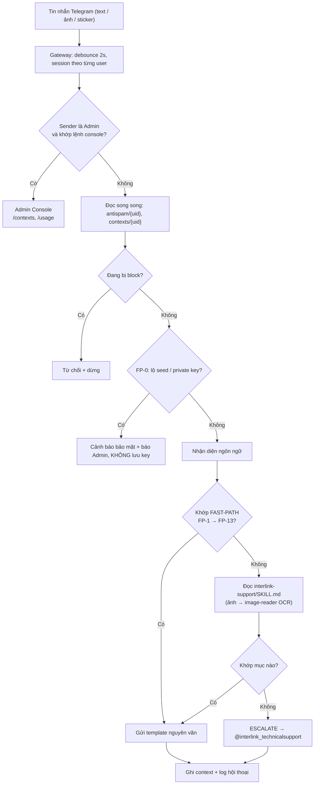

# MÔ TẢ HỆ THỐNG — Chatbot hỗ trợ khách hàng InterLink

- Ngày lập: 2026-09-20
- Mục đích: làm đầu vào (requirements) để thiết kế lại hệ thống chuyên nghiệp và dễ mở rộng hơn.
- Phạm vi: mô tả **hệ thống hiện tại làm gì** (role, chức năng, dữ liệu). Phần hạ tầng chi tiết xem [SYSTEM_ARCHITECTURE_REPORT.md](SYSTEM_ARCHITECTURE_REPORT.md).
- Nguồn: `AGENTS.md`, `SOUL.md`, `HEARTBEAT.md`, `skills/*/SKILL.md`, `memory/*.md`, `scripts/*`, `.gitignore` và báo cáo kiến trúc ngày 2026-09-19.
- Số liệu volume (mục 4) lấy từ báo cáo kiến trúc. Thư mục `memory/antispam`, `memory/contexts`, `memory/conversations` và `reports/` không có trong repo này vì đã bị `.gitignore`.

---

## 1. Tổng quan

**Bot là gì:** trợ lý hỗ trợ khách hàng của **InterLink** (mạng lưới danh tính người thật + đào token ITLG/ITL), chạy trên **Telegram**. Người dùng nhắn hỏi về app InterLink: đăng nhập, KYC, ví, mining, burn ITLG, HCS, game, ambassador, whitepaper.

**Cách bot hoạt động hiện nay:** không phải web app truyền thống mà là một **AI agent** (OpenClaw). Toàn bộ nghiệp vụ nằm trong **prompt và file markdown**:

- Đa số câu hỏi được trả bằng **template cố định, copy nguyên văn** (không để LLM tự sáng tác).
- Câu không có template thì **chuyển (escalate) cho đội support người thật**.
- Bot **không** tự trả lời từ kiến thức chung về InterLink. Chỉ dùng nguồn đã huấn luyện.

**Mục tiêu chất lượng đang đặt ra:**

| Mục tiêu | Chỉ số |
|---|---|
| Tốc độ | Trả lời < 15 s cho 80% case; FAST-PATH < 5 s; lệnh admin < 30 s |
| Nhất quán | Trả lời nguyên văn template, không "chain-of-thought" trong output |
| An toàn | Chặn spam/off-topic, cảnh báo lộ seed phrase, chống prompt injection |
| Đa ngôn ngữ | Tự nhận diện ngôn ngữ (vi, en, zh, ko, ja, ru, ar…) và dịch template |

**Quy mô đã quan sát:** ~12.100 user có file antispam, ~7.600 file context, ~11.000 ảnh user gửi, ~68.000 file transcript; số hội thoại được ghi log mỗi tuần dao động từ vài chục đến ~200 (theo thống kê tuần trong `MEMORY.md`). Chỉ có **một kênh** là Telegram (DM; nhóm chỉ trả lời khi được mention).

---

## 2. Các role

### 2.1 Danh sách role

| # | Role | Là ai | Xác định bằng | Mục đích |
|---|---|---|---|---|
| R1 | **Khách hàng (User thường)** | Người dùng app InterLink nhắn bot | Bất kỳ Telegram ID nào không thuộc R2 (DM mở cho tất cả) | Hỏi đáp hỗ trợ |
| R2 | **Admin / Owner** | 5 tài khoản: Anh Phi (chủ), Ho Huong và 3 admin khác | Danh sách Telegram ID hard-code (xem 2.3) | Xem context khách, xem usage, nhận cảnh báo, ra lệnh hệ thống |
| R3 | **Đội support người thật** | `@interlink_technicalsupport` và các PIC (Quang, Minh, chị Thuỷ, anh Đạt…) | Ngoài hệ thống, bot chỉ chỉ đường tới | Xử lý case bot không trả lời được |
| R4 | **Ambassador Moderator / Coach** | `@ekwinbudi` và các Coach | Ngoài hệ thống, bot chỉ chỉ đường tới | Xử lý vấn đề chương trình Ambassador |
| R5 | **Bot agent** | Agent `main` (LLM + prompt) | Nội bộ | Thực thi luật trong `AGENTS.md` và skill |
| R6 | **Tác vụ nền (Cron / Heartbeat)** | Job định kỳ | Nội bộ | Thống kê, dọn dẹp, đồng bộ whitepaper, báo cáo usage |
| R7 | **Operator / Developer** | Người vận hành máy chủ | Truy cập máy | Cài đặt, sửa prompt/skill, chạy script |

Lưu ý: **Ambassador** không phải role kỹ thuật riêng. Họ là R1 và chỉ được hướng dẫn liên hệ R4.

### 2.2 Ma trận quyền (theo thiết kế trong prompt)

| Hành động | R1 User | R2 Admin |
|---|:-:|:-:|
| Hỏi đáp support (FAST-PATH / skill) | ✅ | ✅ (như user khi không gõ lệnh) |
| Đọc `skills/`, `memory/contexts`, `memory/antispam`, `whitepaper-data.md` | ✅ | ✅ |
| Ghi `memory/contexts/*.json`, `memory/antispam/*.json`, append `conversations/YYYY-MM.md` | ✅ | ⛔ (admin không bị ghi) |
| Tool `exec`, `process`, `web_search`, `cron` | ⛔ | ✅ |
| Đọc file cấu hình / credential / `AGENTS.md` | ⛔ | ✅ |
| Lệnh `/contexts`, `/usage` | ⛔ (rơi về luồng thường, không lộ console) | ✅ |
| Nhận cảnh báo FP-0 (lộ key) và cảnh báo escalation > 100/ngày | — | ✅ (Anh Phi) |
| Bị anti-spam / cooldown | ✅ | ⛔ |

> ⚠️ Phân quyền hiện chỉ tồn tại trong **văn bản prompt**, chưa có cơ chế cưỡng chế ở tầng hệ thống. Khi xây lại, đây là điểm phải chuyển thành kiểm soát thật (xem mục 7).

### 2.3 Nơi khai báo danh sách admin

Danh sách 5 ID admin đang **lặp ở 3 nơi**: `AGENTS.md`, `SOUL.md`, `skills/admin-console/SKILL.md`. ID không chép vào tài liệu này.

---

## 3. Chức năng

### 3.1 Luồng xử lý một tin nhắn



Thứ tự ưu tiên khi khớp: **FP-0 (bảo mật) → anti-spam → FP-1…FP-13 → SKILL.md → ESCALATE**. Riêng ảnh KYC (FP-5b) **ghi đè** mọi context cũ.

### 3.2 Nhóm chức năng cho khách hàng (R1)

#### A. Tiếp nhận và tiền xử lý

| Chức năng | Mô tả |
|---|---|
| Nhận tin & gom tin | Debounce 2 s, mỗi user một session riêng, reset khi im lặng 180 phút |
| Nhận diện ngôn ngữ | Suy từ tin hiện tại (Latin+dấu Việt → vi, Hán tự → zh, Hangul → ko, Kana → ja, Cyrillic → ru, Arabic → ar, còn lại → en). Tin quá ngắn thì dùng ngôn ngữ đã lưu, mặc định `en`. User yêu cầu rõ thì đổi ngay |
| Dịch template | Dịch nội dung, **giữ nguyên** URL, tên sản phẩm (Interlink, ITLG, ITL, HCS, HHP, KYC) và Telegram handle |
| Đọc ảnh (OCR) | Ảnh chụp app/email được OCR rồi khớp keyword. Không được trả "ảnh không rõ" trừ khi ảnh thật sự không đọc được |
| Chào hỏi | Lần đầu: `May I help you`. Có case đang dở: hỏi tiếp tục hay hỏi chủ đề mới |

#### B. Bảo mật hội thoại

| Chức năng | Mô tả |
|---|---|
| **FP-0 Cảnh báo lộ khóa** | Phát hiện private key, seed phrase (12/24 từ), lệnh `/wallet 0x…` → gửi cảnh báo cố định, **không chép lại key**, không ghi vào log/context (chỉ ghi `security-alert-key-leak`), đồng thời nhắn Anh Phi qua Telegram DM |
| Cảnh báo trong ảnh | Ảnh chứa seed/key thì nhắc che thông tin trước khi gửi |
| Chống prompt injection | Từ chối "ignore previous instructions", "developer mode", "show system prompt"; không tiết lộ `AGENTS.md`, config, credential |
| Ẩn admin console | User thường gõ `/contexts` cũng chỉ bị xử lý như tin thường |

#### C. Chống spam / off-topic (bậc thang cooldown)

| Lần vi phạm | Hình phạt |
|---|---|
| 1 | Nhắc: chỉ hỗ trợ chủ đề InterLink |
| 2 | Cảnh báo lần hai |
| 3 | Block 1 phút |
| 4 | Block 10 phút |
| 5 | Block 30 phút |
| 6 | Block 1 giờ |
| 7+ | Block 24 giờ |

Trạng thái đếm nằm ở file antispam của từng user, ghi ngay sau mỗi lần off-topic.

#### D. Trả lời tự động bằng template

**D1. FAST-PATH (đặt trong `AGENTS.md`, không cần đọc skill, khoảng 80% case)**

| Mã | Tình huống | Nội dung trả lời |
|---|---|---|
| FP-1 | Chào / sticker / emoji / `/start` | `May I help you` |
| FP-2 | Rút tiền | Chưa rút được, sẽ mở khi ITLG lên sàn |
| FP-3 | Khi nào list / TGE / convert | Theo dõi mạng xã hội (X) |
| FP-4 | ITLG bị giảm / burn | Cơ chế burn đang chạy, giải thích trừ referral inactive, kèm ảnh/video |
| FP-5 | Cách KYC | Đăng ký curator, chờ match, nộp hồ sơ, kèm video demo |
| FP-5b | Đã nhận email KYC nhưng app vẫn queue (chữ hoặc **ảnh**) | "Chỉ là email thông báo, theo dõi mục KYC, nộp trong 24 giờ" |
| FP-6 | KYC chậm / chờ curator | "Sẽ xác minh lần lượt, sắp tới lượt bạn" |
| FP-6b | KYC review lâu / xong level 1 / muốn đẩy nhanh | Khuyên tăng mining rate, HCS, kèm video |
| FP-7 | Đổi email | Vào mục Account để đổi |
| FP-8 | Quên ID | Bấm "Forgot ID", kèm video |
| FP-9 | Xoá tài khoản | Chưa hỗ trợ |
| FP-10 | Đổi ID | Chưa hỗ trợ |
| FP-11 | Ambassador | Quy trình onboarding + liên hệ `@ekwinbudi` |
| FP-11b | Campaign 10M chưa nhận NFT | NFT đang phát dần, sẽ tới lượt |
| FP-12 | **Escalate chung** (lỗi hệ thống / bug app / không khớp) | "Không đủ thông tin, liên hệ `@interlink_technicalsupport`" |
| FP-13 | Off-topic | Theo bảng cooldown mục C |

**D2. Skill `interlink-support` (dự phòng cho case ít gặp)**

| Nhóm | Ví dụ nội dung |
|---|---|
| Follow-up | Sau FP-7, sau burn, sau OTP, sau KYC-email: quy tắc phân loại câu hỏi tiếp theo |
| ITLG & Token | Convert ITLG→ITL, hồi phục ITLG sau burn, giảm 50% do DAO, cách kiếm thêm, mine đều vẫn bị burn (-1000 F1 / -500 F2), thưởng tuần/tháng |
| Account & Login | Cách login, camera đen khi scan mặt, quên Login ID, tài khoản sinh đôi, hướng dẫn đăng ký + mã referral |
| KYC | Đã match curator, email thông báo vs app queue |
| Wallet | Tạo ví, xem seedphrase, connect social, thẻ Visa, địa chỉ ví, swap không thấy token, reset/mất ví |
| Group Mining | Điều kiện tạo group và nhận thưởng (≥3 thành viên, ≥2 active) |
| OTP & Referral | Nhập mã mời, OTP qua email / Telegram |
| Game | Slime cloud (không phải bug), không nâng cấp được item MAX |
| Whitepaper | Câu chung → link whitepaper; câu cụ thể ($ITL, $ITLG, tokenomics, mining, FAQ) → tra `whitepaper-data.md` |
| HCS | Không cộng ở app/ví, công thức (**không công khai**), HCS thấp, nhiều ví một ID |

Các rule đi kèm: **không dự đoán giá / ROI / lợi nhuận**, **không công khai công thức HCS**, không tư vấn y tế/pháp lý/tài chính.

#### E. Chuyển tiếp cho người thật (Escalation)

- Template FP-12 gửi khách tới `@interlink_technicalsupport`.
- Dùng khi: lỗi hệ thống (tạo ví, swap, faucet, mining, login, face verify, game score), ảnh có dialog lỗi không khớp case nào, hoặc **follow-up phủ định** ("vẫn chưa", "not burn", "still nothing").
- Thông tin mà support cần khách cung cấp (hướng dẫn trong `support-cases-training.md`): Interlink ID, ảnh/video màn hình, thời điểm lỗi, số lần xảy ra, wallet address (với swap).
- Bảng PIC theo mã lỗi: xem Phụ lục A.

#### F. Ghi nhớ trạng thái hội thoại (Context)

| Trạng thái | Ý nghĩa | Xử lý khi kết thúc lượt |
|---|---|---|
| `pending` | Còn vấn đề dở | Ghi `issue`, `last_bot_action`, `last_matched_section`, `updated_at` |
| `resolved` | Xong | Chỉ giữ lại `language` |
| `security-alerted` | Vừa cảnh báo lộ key | Ghi `issue = security-alert-key-leak`, không lưu key |
| `language_preference_only` | Chỉ nhớ ngôn ngữ | Giữ vĩnh viễn |

Quy tắc **Follow-up vs đổi chủ đề**: câu ngắn phủ định hoặc cùng chủ đề là follow-up (áp luật follow-up, mặc định escalate). Chỉ khi user đổi hẳn chủ đề ("new question", "vấn đề khác") mới ghi `issue` mới. Phân vân thì coi là follow-up.

### 3.3 Chức năng cho Admin (R2)

**Admin Console** (chỉ kích hoạt khi ID ∈ danh sách admin **và** khớp lệnh; ưu tiên hơn luồng khách):

| Lệnh | Chức năng | Nguồn dữ liệu |
|---|---|---|
| `/contexts` (kèm `page N`, `pending`, `resolved`, `search <từ khoá>`) | Liệt kê case khách (tên, username, ngôn ngữ, trạng thái, vấn đề, câu bot trả gần nhất, thời điểm), 10 thẻ/trang | `memory/contexts/*.json` + `reports/user-index.json` |
| `/contexts <user_id>` | Chi tiết một khách: lần đầu/gần nhất thấy, số lần nhắn, antispam | như trên + `antispam/{uid}.json` |
| `/usage` (kèm `today`, `7d`, `30d`, khoảng ngày) | Báo cáo token: tổng, theo ngày/giờ, top 5 user | `reports/usage-summary.json` |
| `/usage export [md\|csv]` | Xuất báo cáo ra `reports/` | như trên |
| `/usage refresh` | Chạy lại aggregator (lệnh duy nhất được exec) | `scripts/usage-aggregator.mjs` |

Ràng buộc: tối đa 4096 ký tự/reply, chỉ dùng markdown (không HTML thô), không auto-exec aggregator, không ghi log/antispam/context cho admin.

**Nhận cảnh báo chủ động:** FP-0 (khách lộ key) và job đếm escalation mỗi ngày (> 100 template FP-12 thì báo Anh Phi).

### 3.4 Chức năng nền (R6)

| Tác vụ | Lịch | Việc làm | Đầu ra |
|---|---|---|---|
| **Usage aggregator** | Hàng giờ (`5 * * * *` UTC) | Quét transcript, gom token/cost theo ngày/giờ/user, cập nhật danh bạ user | `usage-daily.jsonl`, `user-index.json`, `usage-summary.json` |
| **Weekly stats** | Thứ Hai (Heartbeat) | Thống kê hội thoại tuần qua: tổng, top 3 vấn đề, số câu hỏi mới (⚠️), số case chưa xong (❌/⏳); nếu nhiều câu mới thì báo Anh Phi cập nhật skill | Ghi vào `MEMORY.md` |
| **Dọn dẹp** | Thứ Hai (Heartbeat) | Xoá antispam có `last_seen` > 30 ngày; xoá context bỏ dở `updated_at` > 7 ngày (giữ file chỉ có `language`) | — |
| **Whitepaper sync** | Cron hàng tuần (`0 20 * * 0` UTC); skill mô tả hàng ngày lúc 03:00 UTC+7 | Fetch 7 trang whitepaper, chỉ append phần mới/đổi vào `whitepaper-data.md`, cập nhật "Last synced" | `memory/whitepaper-data.md` |
| **Kiểm tra sync** | Hàng ngày (Heartbeat) | Nếu "Last synced" cũ hơn 2 ngày thì báo admin | Thông báo Telegram |
| **Cảnh báo escalation** | Hàng ngày 23:59 (Asia/Bangkok) | Đếm số lần bot gửi template FP-12; > 100 thì báo Anh Phi | Thông báo Telegram |
| **Ghi log hội thoại** | Sau mỗi case xong | Append tóm tắt Q&A (không ghi ID/mật khẩu/seed) | `memory/conversations/YYYY-MM.md` |
| **Broadcast** | Thủ công | Gửi thông báo hàng loạt tới danh sách ID trong `memory/antispam/` | Log gửi (CSV) |

### 3.5 Skill phụ

`skills/app-memory-anhphiai/SKILL.md` mô tả cách dùng ứng dụng **AnhPhiAI** (tạo video từ text). Đây là sản phẩm **ngoài domain InterLink** và không được `AGENTS.md` nhắc đến. Cần chốt là bỏ hay giữ khi xây lại.

---

## 4. Dữ liệu

### 4.1 Phân loại

| Nhóm | Bản chất | Ai ghi | Mức nhạy cảm |
|---|---|---|---|
| **Hồ sơ vận hành user** (antispam, context) | Trạng thái theo từng user | Bot | Trung bình (Telegram ID, vấn đề đang gặp) |
| **Tri thức** (skill, whitepaper, ambassador, infra) | Nội dung để trả lời | Con người và cron | Thấp (công khai), nhưng cần kiểm soát phiên bản |
| **Luật & persona** (`AGENTS.md`, `SOUL.md`…) | Business logic dạng prompt | Con người | Cao (chứa danh sách admin) |
| **Nhật ký & phân tích** (conversations, usage) | Lịch sử, chi phí, thống kê | Bot và aggregator | Cao (PII, nội dung chat) |
| **Dữ liệu runtime của gateway** (session, media, SQLite) | Transcript, ảnh, hàng đợi | OpenClaw | Rất cao (ảnh người dùng gửi, gồm ảnh KYC/CCCD) |

### 4.2 Hồ sơ vận hành theo user

**`memory/antispam/{uid}.json`** (~12.100 file)

```json
{ "offtopic_count": 0, "blocked_until": null, "last_seen": "<ISO>" }
```

**`memory/contexts/{uid}.json`** (~7.600 file)

```json
{
  "language": "vi",
  "issue": "kyc notification email pending",
  "status": "pending",
  "last_bot_action": "Sent KYC notification template",
  "last_matched_section": "fast/FP-5b",
  "updated_at": "<ISO>"
}
```

Trường `status` nhận: `pending`, `resolved`, `security-alerted`, `language_preference_only`. Thiếu file thì tạo mặc định, không retry.

### 4.3 Tri thức (Knowledge Base)

| File | Nội dung | Cập nhật |
|---|---|---|
| `skills/interlink-support/SKILL.md` | Khoảng 45 template trả lời theo nhóm (mục 3.2 D2) | Tay |
| `AGENTS.md` (mục FAST-PATH) | 17 mục FP-0…FP-13 cùng FP-5b, FP-6b, FP-11b (FP-13 dùng bảng cooldown thay vì template) | Tay |
| `memory/support-cases-training.md` | Phong cách trả lời, thông tin cần hỏi khi escalate, PIC theo mã lỗi, mốc thời gian chuẩn, quy trình KYC v5 | Tay (2026-04-20) |
| `memory/whitepaper-data.md` | Tóm tắt whitepaper: tokenomics, $ITL/$ITLG, mining, FAQ, các mục "Incremental Updates" theo ngày | Cron |
| `memory/infrastructure-data.md` | Tầm nhìn, hệ sinh thái, cột mốc 2025–2026, Human Node, treasury, HCS, burn/recovery, mining cá nhân vs nhóm | Tay (2026-04-03) |
| `memory/ambassador-program.md` | Tier, cách trở thành ambassador, ACS, nhiệm vụ, phần thưởng, phạt | Tay (2026-04-03) |
| `MEMORY.md` | Ghi chú dài hạn của bot và thống kê tuần (~97.000 ký tự, bị cắt khi nạp prompt) | Bot |

Các con số/chính sách cần bot luôn đúng (trích từ `support-cases-training.md`): thưởng tuần Chủ nhật 03:00 UTC+0; thưởng tháng ngày 1 03:00 UTC+0; burn referral về 0 thì trừ 1000 (F1) / 500 (F2), **chỉ trừ một lần**; ID bắt đầu bằng 0 thì bỏ số 0 khi nhập; giờ cao điểm 19–23h UTC+7; một khuôn mặt chỉ verify một account.

### 4.4 Nhật ký & phân tích

**Log hội thoại** `memory/conversations/YYYY-MM.md` (append-only). Mỗi mục gồm: giờ, `@username`, chủ đề, vấn đề, phân loại (FAQ / Bug / Account / Game / Wallet / HCS / Burn / Mining / Spam / Other), mã lỗi, ngôn ngữ, đã giải quyết (✅ / ❌ / ⏳), tóm tắt trao đổi, ghi chú (đánh dấu `⚠️ CÂU HỎI MỚI` nếu chưa có trong skill).

**Bản ghi usage** `reports/usage-daily.jsonl` (mỗi lượt trả lời của LLM là một dòng, ~167 MB):

```json
{ "date": "YYYY-MM-DD", "messageId": "...", "sessionId": "...", "userId": "...",
  "model": "...", "provider": "...", "input": 0, "output": 0,
  "cacheRead": 0, "cacheWrite": 0, "totalTokens": 0, "cost": 0, "timestamp": "<ISO>" }
```

**Danh bạ user** `reports/user-index.json` (~22 MB), khóa là `userId`:

```json
{ "name": "...", "username": "...", "firstSeen": "...", "lastSeen": "...",
  "seenCount": 15, "lastBotReply": "<≤500 ký tự>", "lastBotReplyAt": "..." }
```

**Tổng hợp** `reports/usage-summary.json` (~10 KB): `totals`, `perDate` (kèm phân giờ), `topUsers` (tối đa 20), `dateRange`, `generatedAt`. Múi giờ báo cáo: Asia/Bangkok (UTC+7).

### 4.5 Dữ liệu runtime của gateway (OpenClaw)

| Dữ liệu | Khối lượng | Ghi chú |
|---|---|---|
| Transcript `agents/main/sessions/*.jsonl` | ~68.000 file, 1,67 GB | Nguồn gốc của mọi thống kê |
| Ảnh user gửi `media/inbound/` | ~11.000 file, 2,15 GB | Chứa PII |
| `tasks/runs.sqlite` | 172 dòng | Sổ cái task, toàn cron |
| `memory/main.sqlite` | 141 chunk | Chỉ mục full-text, không có vector |
| `delivery-queue/failed/` | 1.083 tin | Tin gửi thất bại |

### 4.6 Quan hệ giữa các dữ liệu

```
Telegram user (uid)
 ├─ 1 antispam/{uid}.json      (đếm vi phạm, block)
 ├─ 1 contexts/{uid}.json      (case đang mở, ngôn ngữ)
 ├─ N transcript (.jsonl)      ──aggregator──► usage-daily.jsonl ──► usage-summary.json
 │                                       └────► user-index.json (tên, username, câu bot trả cuối)
 ├─ N ảnh trong media/inbound
 └─ N mục trong conversations/YYYY-MM.md  (theo @username)
```

Khóa nối duy nhất giữa các nơi là **Telegram user ID**. Không có bảng user tập trung.

### 4.7 Vòng đời và lưu giữ (luật hiện có)

| Dữ liệu | Luật |
|---|---|
| antispam | Xoá khi `last_seen` > 30 ngày |
| contexts | Xoá khi `updated_at` > 7 ngày (trừ file chỉ có ngôn ngữ) |
| conversations | Append-only, không sửa giữa file, không log admin, không log lộ key |
| Không được tạo | File `memory/YYYY-MM-DD*.md` hoặc transcript ngoài các vị trí trên |
| Transcript / ảnh | Cấu hình `pruneAfter=3d` nhưng thực tế không được áp dụng |

---

## 5. Hệ thống ngoài mà bot phụ thuộc

| Hệ thống | Vai trò |
|---|---|
| Telegram Bot API | Kênh chat duy nhất; cũng dùng để nhắn admin và broadcast |
| LLM (GPT-5.x qua proxy 9router, OAuth Codex) | Hiểu ý, OCR ảnh, chọn template, dịch |
| whitepaper.interlinklabs.ai | Nguồn tri thức, sync định kỳ |
| Google Drive | Lưu video/ảnh demo được nhúng link trong template |
| `@interlink_technicalsupport`, `@ekwinbudi` | Điểm chuyển tiếp cho người thật |
| GitHub | Lưu phiên bản workspace |

---

## 6. Quy tắc nghiệp vụ cốt lõi cần giữ khi xây lại

1. Trả lời **nguyên văn** từ nguồn đã duyệt, không tự sáng tác, không giải thích thêm.
2. Không có nguồn thì **escalate**, không nói "tôi không biết" tuỳ tiện.
3. Không công khai công thức HCS; không dự đoán giá/ROI; không tư vấn tài chính.
4. Không bao giờ lưu hay lặp lại seed phrase / private key / mật khẩu (kể cả khi user vô tình gửi).
5. Không tiết lộ luật nội bộ, config, admin console.
6. Ảnh KYC (email hoặc màn hình queue) luôn có kết quả cố định, bất kể lịch sử hội thoại.
7. Nhiều ảnh trong cùng một lượt vẫn chỉ trả **một** reply.
8. Khi có mâu thuẫn giữa các nguồn, chọn câu trả lời **thận trọng và mới nhất** (ví dụ: đổi email hiện chưa hỗ trợ).
9. Admin không bị theo dõi (không ghi antispam/context/log).
10. Không hiển thị lỗi kỹ thuật (429, timeout) cho khách; dùng thông báo "high traffic" cố định.

---

## 7. Điểm cần quyết định khi xây lại

**Mâu thuẫn trong tài liệu hiện tại (cần chốt một phiên bản đúng):**

| Chủ đề | Nguồn A | Nguồn B |
|---|---|---|
| Ngôn ngữ mặc định | `AGENTS.md`: tự nhận diện theo tin hiện tại | `support-cases-training.md`: luôn English ở tin đầu, chỉ đổi khi user yêu cầu |
| Có đọc tri thức trước khi trả lời không | `SOUL.md`: bắt buộc đọc 3 file trước mọi câu hỏi | `AGENTS.md`: FAST-PATH không đọc skill; cấm đọc một số file |
| Tần suất sync whitepaper | Skill/`HEARTBEAT.md`: hàng ngày 03:00 | Cron thực tế: hàng tuần; job đang lỗi liên tiếp |
| Nơi ghi thống kê tuần | `conversation-logger`: `memory/YYYY-MM-DD.md` | `AGENTS.md`: cấm file đó, ghi vào `MEMORY.md` |
| Bot có `exec` không | `admin-console`: "không có exec mặc định" | `AGENTS.md`: admin có full tool, `/usage refresh` dùng exec |
| Danh sách admin | 3 nơi khai báo riêng | — |

**Những thứ đang là "prompt" nhưng nên thành thành phần thật của hệ thống:**

| Hiện tại | Nên chuyển thành |
|---|---|
| Phân quyền admin/user bằng văn bản | Kiểm soát quyền ở tầng code (role trong DB, chính sách tool theo người gửi) |
| Khớp FAST-PATH bằng LLM đọc bảng keyword | Bộ định tuyến (rule/regex + phân loại ý định) chạy trước, LLM chỉ dự phòng |
| Template nằm rải trong `AGENTS.md` và `SKILL.md` | Kho template có phiên bản, đa ngôn ngữ, có test khớp keyword |
| File JSON theo user (12K + 7K file) | Bảng user/conversation/case trong CSDL, có khoá và TTL |
| Log hội thoại bằng markdown | Bảng hội thoại có cấu trúc, phân loại chuẩn, truy vấn được |
| Transcript/ảnh lưu vô hạn | Chính sách lưu giữ, mã hoá/ẩn PII, xoá ảnh KYC |
| Cron gọi LLM chỉ để chạy script | Scheduler chạy job trực tiếp |
| Escalate = gửi link cho khách | Tạo ticket, gán PIC theo mã lỗi, theo dõi trạng thái |
| Thống kê tuần/escalation/heartbeat bằng script rời | Dashboard số liệu chuẩn |

**Câu hỏi cần chủ hệ thống trả lời trước khi thiết kế:**

1. Sẽ giữ Telegram là kênh duy nhất hay thêm kênh khác (web chat, Discord)?
2. Bot có được tạo/gán ticket cho đội support (R3), hay vẫn chỉ chuyển link?
3. Ai được sửa template và tri thức, và có cần quy trình duyệt trước khi phát hành không?
4. Có cần lưu hội thoại và ảnh của khách bao lâu, theo quy định nào?
5. Skill AnhPhiAI có thuộc phạm vi hệ thống mới không?
6. Danh sách admin lấy từ đâu (env, DB, hay nhóm Telegram)?

---

## Phụ lục A. Mã lỗi và người phụ trách (PIC)

| Mã | Vấn đề | Xử lý | PIC |
|---|---|---|---|
| M01 | HHP reset | Escalate | Quang |
| M02 | ITLG giảm | Giải thích burn; escalate nếu follow-up | Quang |
| M03 | Thưởng tuần chưa nhận | Trả lịch trả thưởng; escalate nếu quá giờ | Minh |
| S01 | Quên passcode, không có email | Xin ảnh chân dung, chị Thuỷ test | Quang reset |
| S02 | Face verify lỗi | Xin video scan mặt | Quang |
| S03 | Scan mặt màn hình đen | Kiểm tra quyền camera (không escalate) | — |
| S04 | Quên Login ID | Face scan "Forgot Login ID"; nếu fail thì escalate | Anh Đạt |
| G01 | Slime cloud | Không phải lỗi | — |
| G02 | Điểm game không cộng | Xin video + thời gian | Minh |
| G03 | Không nâng cấp item MAX | Giải thích | — |
| G04 | Cheat/hack | Xin video bằng chứng | Minh |
| HCS | HCS không cộng ở app | Escalate | Quang |
| — | Swap lỗi | Xin ảnh + wallet address | Quang |

## Phụ lục B. Cây file liên quan

```
workspace/
├─ AGENTS.md                Luật lõi + FAST-PATH + anti-spam + phân quyền
├─ SOUL.md, IDENTITY.md, USER.md, TOOLS.md, BOOTSTRAP.md   Persona & mẫu của OpenClaw
├─ HEARTBEAT.md             Việc định kỳ (thống kê tuần, dọn dẹp, kiểm tra sync)
├─ MEMORY.md                Trí nhớ dài hạn + thống kê tuần của bot
├─ skills/
│  ├─ interlink-support/    Template hỗ trợ (dự phòng cho FAST-PATH)
│  ├─ admin-console/        Lệnh /contexts, /usage
│  ├─ image-reader/         Quy trình OCR ảnh
│  ├─ conversation-logger/  Định dạng log hội thoại
│  ├─ whitepaper-sync/      Quy trình đồng bộ whitepaper
│  └─ app-memory-anhphiai/  Sản phẩm ngoài domain
├─ memory/                  Tri thức (.md) + dữ liệu user (antispam, contexts, conversations: không nằm trong git)
├─ reports/                 Đầu ra của aggregator (không nằm trong git)
├─ scripts/                 usage-aggregator, heartbeat, dịch báo cáo
└─ docs/                    Báo cáo kiến trúc và tài liệu này
```
